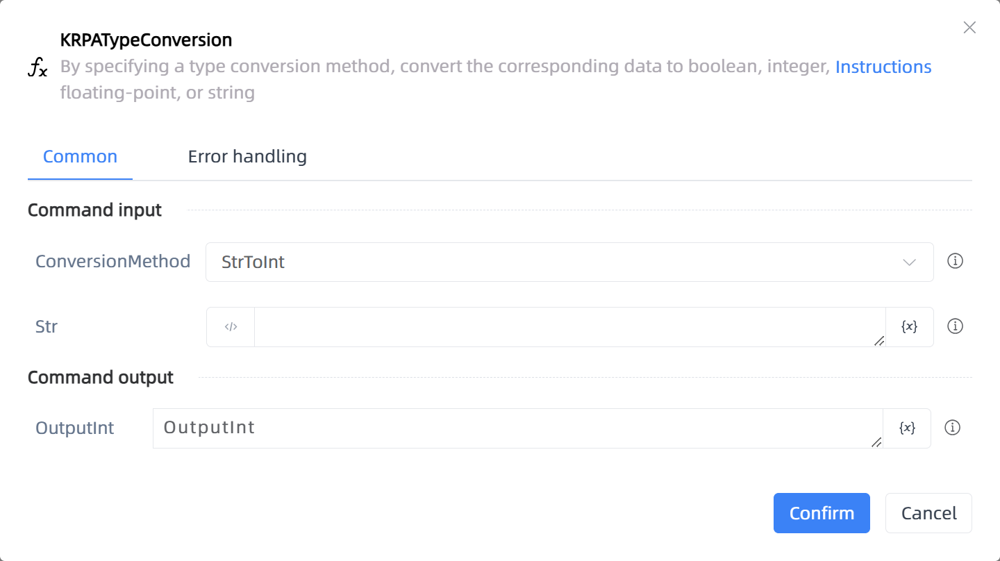

# KRPATypeConversion

## Function Description

:::tip 
By specifying a type conversion method, convert the corresponding data to boolean, integer, floating-point, or string
:::

## Configuration Item Description

### General

**Command Input**

- **ConversionMethod**`Integer`: Select data type conversion method, special instructions: [Character to Boolean: returns false when filled in with '0', returns true when filled in with other values] [Floating point to integer: rounded to integer] [Boolean to integer: True returns' 1 ', Curse returns' 0']

- **Str**`string`: Input string data or string variables

- **Int**`Integer`: Input integer data or integer variables

- **Bool**`Boolean`: Check to True, otherwise False

- **Float**`Double`: Input floating-point data or floating-point variables

**Command Output**

- **OutputStr**`string`: Output data through type conversion

- **OutputInt**`Integer`: Output data through type conversion

- **OutputBool**`Boolean`: Output data through type conversion

- **OutputFloat**`Double`: Output data through type conversion

**Command Output**

### Error Handling

- **Print Error Logs**`Boolean`: Whether to print error logs to the "Logs" panel when the command fails. Default is checked. 

- **Handling Method**`Integer`:

    - **Terminate Process**: If the command fails, terminate the process.

    - **Ignore Exception and Continue Execution**: If the command fails, ignore the exception and continue the process.

    - **Retry This Command**: If the command fails, retry the command a specified number of times with a specified interval between retries.

## Usage Example

Process logic description:

## Common Errors and Handling

None

## Frequently Asked Questions

None

