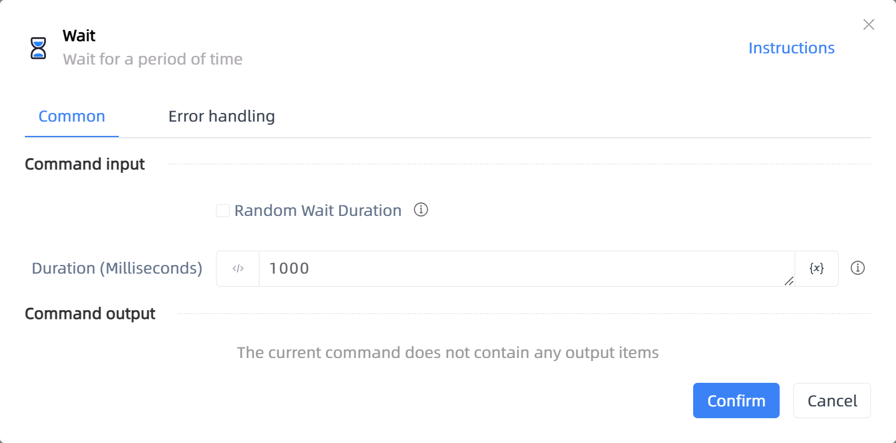

# Wait

## Function Description

:::tip 
Wait for a period of time
:::

## Configuration Item Description

### General

**Command Input**

- **Random Wait Duration**`Boolean`: The wait duration is a random number

- **Duration (Milliseconds)**`Integer`: Wait duration

- **Minimum Duration (Milliseconds)**`Integer`: The random number is generated from the range between the start and end numbers, inclusive of both

- **Maximum Duration (Milliseconds)**`Integer`: The random number is generated from the range between the start and end numbers, inclusive of both

**Command Output**

No output for the current command

### Error Handling

- **Print Error Logs**`Boolean`: Whether to print error logs to the "Logs" panel when the command fails. Default is checked. 

- **Handling Method**`Integer`:

    - **Terminate Process**: If the command fails, terminate the process.

    - **Ignore Exception and Continue Execution**: If the command fails, ignore the exception and continue the process.

    - **Retry This Command**: If the command fails, retry the command a specified number of times with a specified interval between retries.

## Usage Example

Process logic description:

## Common Errors and Handling

None

## Frequently Asked Questions

None

