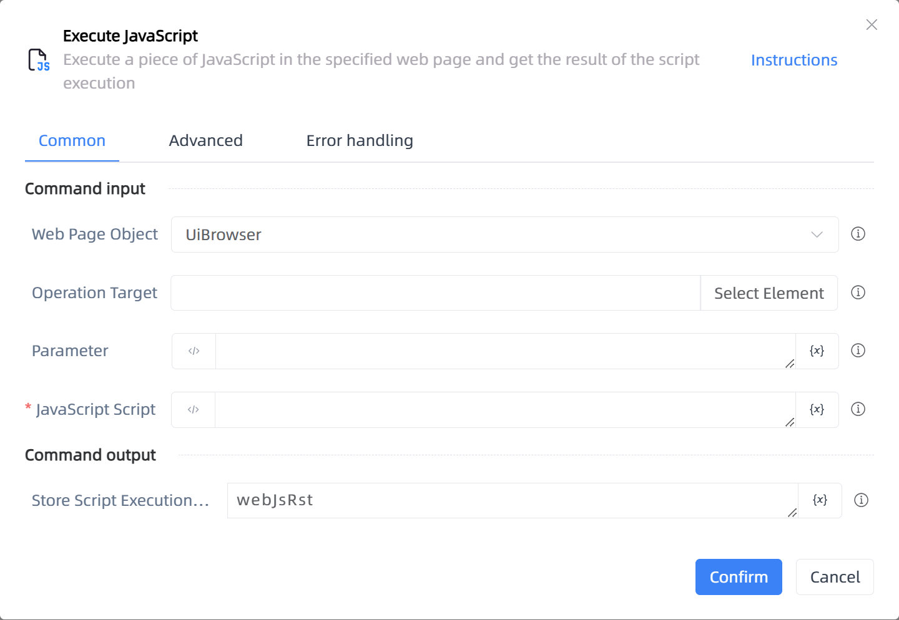

# Execute JavaScript

## Function Description

:::tip 
Execute a piece of JavaScript in the specified web page and get the result of the script execution
:::

## Configuration Item Description

### General

**Command Input**

- **Web Page Object**`TBrowser`: Enter a web page object that has been obtained or created by the 'Open Web Page' function

- **Operation Target**`TTarget`: Select the web element to operate on

- **Parameter**`string`: Fill in the parameters to be passed into the JavaScript

- **JavaScript Script**`string`: Write a piece of JavaScript for execution

**Command Output**

- **Store Script Execution Result To**`string`: Specify a variable to store the script execution result

### Advanced

- **Wait for Element to Exist (Milliseconds)**`Integer`: Timeout time to wait for the element to exist

- **Execution Environment**`Integer`: The target execution environment for the JS script

- **Delay Before (ms)**`Integer`: The waiting time before instruction execution

**Command Output**

### Error Handling

- **Print Error Logs**`Boolean`: Whether to print error logs to the "Logs" panel when the command fails. Default is checked. 

- **Handling Method**`Integer`:

    - **Terminate Process**: If the command fails, terminate the process.

    - **Ignore Exception and Continue Execution**: If the command fails, ignore the exception and continue the process.

    - **Retry This Command**: If the command fails, retry the command a specified number of times with a specified interval between retries.

## Usage Example

Process logic description:

## Common Errors and Handling

None

## Frequently Asked Questions

None

