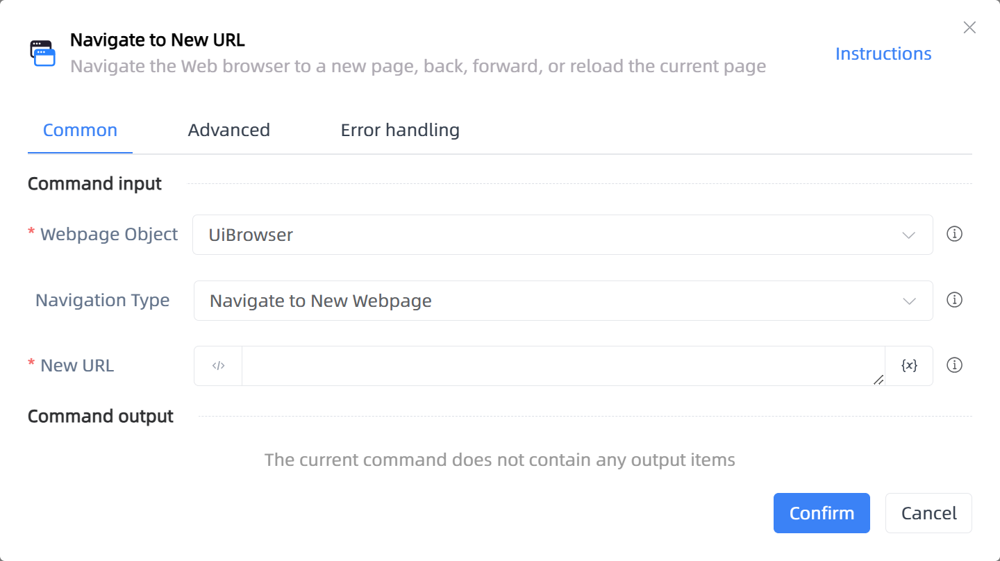

# Navigate to New URL

## Function Description

:::tip 
Navigate the Web browser to a new page, back, forward, or reload the current page
:::

## Configuration Item Description

### General

**Command Input**

- **Webpage Object**`TBrowser`: Enter a webpage object that has been obtained or created through the 'Open Webpage' function

- **Navigation Type**`Integer`: The type of web navigation

- **New URL**`string`: The target URL for navigation

**Command Output**

No output for the current command

### Advanced

- **Page Load Timeout (milliseconds)**`Integer`: The timeout for the page to load completely

- **Delay Before (ms)**`Integer`: The waiting time before instruction execution

**Command Output**

### Error Handling

- **Print Error Logs**`Boolean`: Whether to print error logs to the "Logs" panel when the command fails. Default is checked. 

- **Handling Method**`Integer`:

    - **Terminate Process**: If the command fails, terminate the process.

    - **Ignore Exception and Continue Execution**: If the command fails, ignore the exception and continue the process.

    - **Retry This Command**: If the command fails, retry the command a specified number of times with a specified interval between retries.

## Usage Example

Process logic description:

## Common Errors and Handling

None

## Frequently Asked Questions

None

