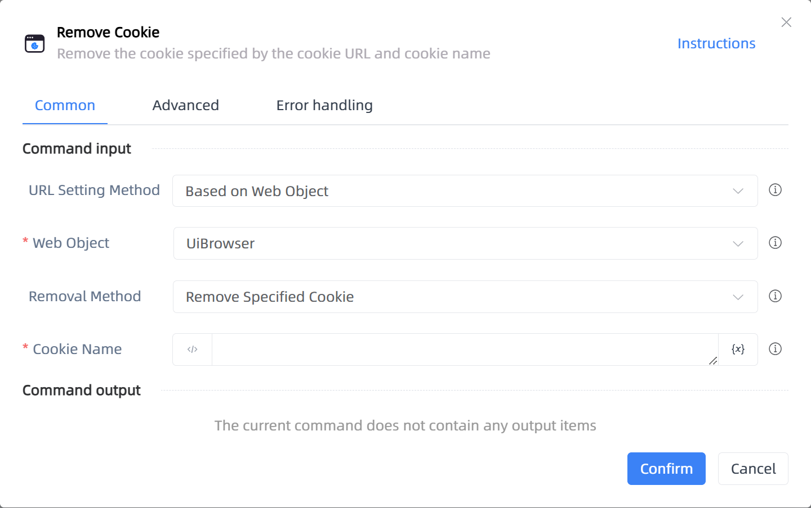

# Remove Cookie

## Function Description

:::tip 
Remove the cookie specified by the cookie URL and cookie name
:::

## Configuration Item Description

### General

**Command Input**

- **URL Setting Method**`Integer`: The source of the cookie URL setting value; you can choose to manually enter it, or if you select a web object, the web page URL will be automatically used

- **Web Object**`TBrowser`: Enter a web object that has been obtained or created through the 'Open Web Page' function

- **Browser Type**`Integer`: Set the type of browser for the cookie

- **Cookie URL**`string`: The cookie URL to be removed

- **Removal Method**`Integer`: 

- **Cookie Name**`string`: The name of the cookie to be removed

**Command Output**

No output for the current command

### Advanced

- **Delay Before (ms)**`Integer`: The waiting time before instruction execution

**Command Output**

### Error Handling

- **Print Error Logs**`Boolean`: Whether to print error logs to the "Logs" panel when the command fails. Default is checked. 

- **Handling Method**`Integer`:

    - **Terminate Process**: If the command fails, terminate the process.

    - **Ignore Exception and Continue Execution**: If the command fails, ignore the exception and continue the process.

    - **Retry This Command**: If the command fails, retry the command a specified number of times with a specified interval between retries.

## Usage Example

Process logic description:

## Common Errors and Handling

None

## Frequently Asked Questions

None

