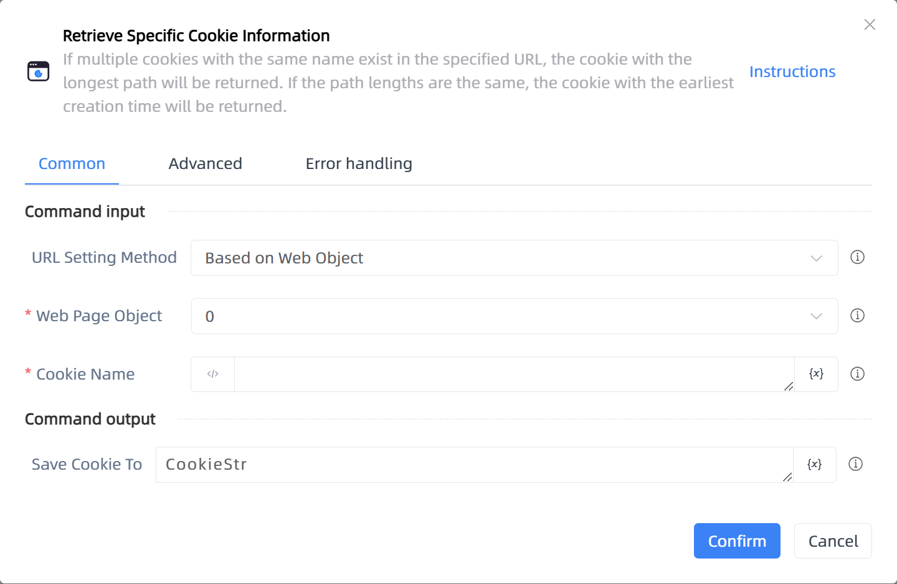

# Retrieve Specific Cookie Information

## Function Description

:::tip 
If multiple cookies with the same name exist in the specified URL, the cookie with the longest path will be returned. If the path lengths are the same, the cookie with the earliest creation time will be returned.
:::

## Configuration Item Description

### General

**Command Input**

- **URL Setting Method**`Integer`: The source for setting the Cookie URL value, which can be manually entered. If a web object is selected, the web page's URL will be used automatically.

- **Web Page Object**`TBrowser`: Enter a web page object that has been obtained or created using the 'Open Web Page' function.

- **Browser Type**`Integer`: Set the browser type for specific cookies.

- **Cookie URL**`string`: URL filter condition

- **Cookie Name**`string`: Ignore if CookieName is empty

**Command Output**

- **Save Cookie To**`string`: Save the obtained cookie

### Advanced

- **Delay Before (ms)**`Integer`: The waiting time before instruction execution

**Command Output**

### Error Handling

- **Print Error Logs**`Boolean`: Whether to print error logs to the "Logs" panel when the command fails. Default is checked. 

- **Handling Method**`Integer`:

    - **Terminate Process**: If the command fails, terminate the process.

    - **Ignore Exception and Continue Execution**: If the command fails, ignore the exception and continue the process.

    - **Retry This Command**: If the command fails, retry the command a specified number of times with a specified interval between retries.

## Usage Example

Process logic description:

## Common Errors and Handling

None

## Frequently Asked Questions

None

