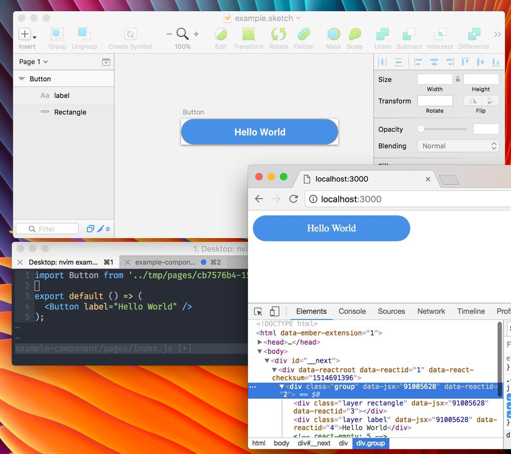
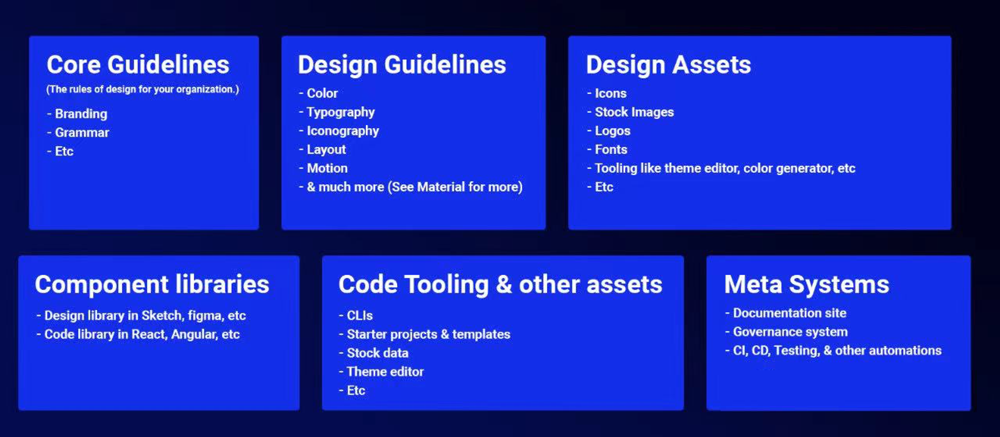
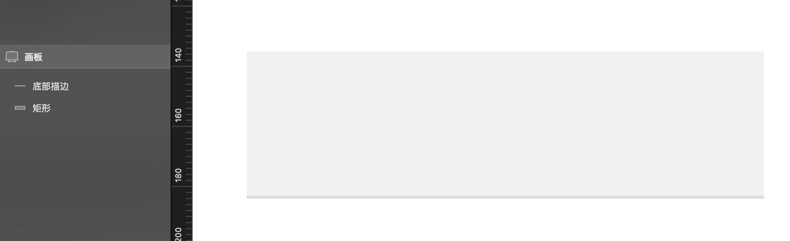

# 什么是设计资产数字化？

2020-03-10

## 概念由来

2017 年 Sketch 43 的发布，文件格式开源和 JSON 化，前端代码和设计稿的互转和同步成为可能。



于是 Airbnb 工程师 Jon Gold 做了 [react-sketchapp](https://github.com/airbnb/react-sketchapp), 简单来说就是设计师用 React 语法写视觉稿。


## 这样做的好处是什么呢?

- 用代码管理可复用的设计资源;
- 用真实的数据和组件去驱动设计。

react-sketchapp 希望设计师用 React 代码去制作和管理 Sketch 设计资产(比如颜色系统, 字体系统, UI 层组件)。


## 工程上解决了什么问题?

1.  保证设计的可行性:

    - 举个例子: 比如 一个元素的底部描边, 在设计稿中, 这可能是两个图形或者用阴影去制作; 而真实开发实现的时候可能只有一个 dom, 一行代码;
       >

    ```css
     {
      border-bottom: 1px solid #ddd;
    }
    ```

2.  提高前端实现还原度, 拉通设计与实现不一致的问题;

    ::: tip 💡
    样式都交给设计师了, 就不会有扯皮的现象
    :::

3.  节省 UI 开发时间: 让工程师可以有更多的时间专注在业务代码上;

## 挑战在哪?

1.  需要设计师具备初级 web 工程师的能力;

    ::: tip 💡
    其实不是一蹴而就的, 设计师 和 web 工程师的技能重合度很低, 但是关联性又很强。
    :::

2.  在用代码去 ”写” , 设计稿这件事情上, 对设计师语义化的要求很高;

    ::: tip 💡
    这里的语义化只指, 思维模式, 通常设计师在用设计工具的时候, 不会有”文本流意识”。
    :::

- 按照 Jon Gold 的说法, 他们似乎创造了一个新的职业(设计实现工程师)。在这种模式下, 设计团队能够自己产出代码片段, 有完整的工作流, 能够用真实的业务数据去驱动设计, 按照工程化的方式管理设计系统。 查看 Jon Gold 的 [原文](https://airbnb.design/painting-with-code/)。

## 中场总结

以上故事都发生在 2017 年, 现在回头看, airbnb, facebook 确实在不同程度做到数字化管理设计资产。

这套流程区别于以往的 程序(设计软件, 原型软件)面向设计, 而是让设计面向开发。抛开 "政治正确" 不谈, 首先运行这套模式需要有需求, 首先公司要大, 产品线广泛, 需要维护一套设计系统(比如: Material Design 之于 Google, AntDesign 之于蚂蚁金服), 同时这套设计系统他不会完全固化, 会随着时间进化, 迭代。

::: tip 💡
当一个设计模式成为产业链时, 替换模式势必会影响产业链上所有人的利益, 此时变革者的第一身份是搅局者, 于是如何聚合团队是最重要的事情
:::

### 对我们工作上的意义

我们处在一个设计与前端融合的时代, 设计工具与前端工具自 Adobe Dreamweaver 后就一直在双向奔赴。

::: tip 设计趋势的观察:

- 2014 年, sketch 3.0 发布, 让设计稿转变成 HTML 成为可能;
- 2015 年, Flinto 等 POP 类工具陆续发布, 使得设计师低成本拥有了交互动画能力;
- 2016 年, Framer(轻量化脚本)、Origami(逻辑图形化)相继发布, 设计师学习少量代码就可能获得更多的交互动画能力;
- 2017 年, Lottie 发布, 让简单的 AE Motion 可以导出 Json 让前端人员可以直接使用动画工程;
- 同年, Airbnb 发布了  [**React Sketch.app**](https://www.zhihu.com/question/59069953/answer/162063303)  让设计面向开发成为可能;
- 2019 年, Figma 开始流行(国内已经有仿制), 接着像  [Zeroheight](https://zeroheight.com/) 这种第三方规范管理平台如雨后春笋般接连发布, 未来的设计部门的工作流程一定会有翻天覆地的变化…

:::

## 结合咱们得工作现状

### 大部分产研现状

到目前为止, 大部分公司设计文件与业务组件代码时分离的, 且可能权责归属都可能是两个部门。如果还要算上 产品经理的 axure 组件, 那么情况会更复杂。这个时候, 完成一个界面需要:

> 产品的低保真 → 设计的高保真 → 开发的实际实现

三个步骤, 效率极低, 出现问题互相扯皮。

::: tip 产品经理:

🦊 “兄弟们, 加快进度呀, 啥? 图还没画完? 别管了, 拿之前的页面套。”

:::

::: tip 设计师:

🦁 “每天都在’沉浸式’画图, 我们画的图开发真的看了吗? 产品需求来的太快, 短则三四天, 最长的也只有一个月, 业务都没了解清楚就催着赶紧出图转研了。”

:::

::: tip 开发:

🦧 “我们其实希望设计师直接用已有的组件和模板进行在线组装, 跳过设计稿阶段, 如果设计方案稳定, 我们可以做很多高质量的代码片段, 来提升研发效率和代码可靠性。”

:::

### 运用设计资产数字化能解决问题吗?

我们可以使用 react-sketchapp 让 React 的代码成为唯一的标准，通过一份代码渲染: 组件 + 生成 sketch 文件 + axure 元件, 同时满足 产品, 设计, 开发 的需求, 让低保真, 高保真, 实际实现高度统一。

::: tip 👣

经过实践, 不一定非得会 React 才能进行设计资产数字化, 我们可以通过其他工具做到逐步实现, 比如使用 taiwindcss。

:::

### 如何实施?

1. 制度:
   设计改谁主导? 如果回到本质, 一切的设计最终都会编译成数据结构。但是不同的职位有不同的看法, 工程师觉得代码主导更可靠, 因为代码本身就是在描述数据结构; 而设计师会觉得代码成本过高, 灵活性低, 限制了他们的创造力。一言以蔽之, 这是创造工作和开发工作的方式之争;

   **怎么解决?**

   组建一个复合团队, 将部门之间的问题转化为部门内部问题;

   ::: tip 👣

   经过实践, 先由我与前端团队配合工作, 从样式入手, 然后逐渐过度到公共组件, 页面模板保证设计系统稳健。

   :::

2. 人
   能够在设计与开发都了解的人很少, 一方面是思维模式差异, 另一方是目前国内教育体系不支持;

   **怎么解决?**

   依靠内部培训, 用工作外的时间组织学习(卷-文章标题图标的意义), 逐步过渡直到完全实现设计资产数字化。

   ::: tip 👣

   经过实践, 可以通过 40 个课时帮助团队成员 0 基础学会布局, CSS 样式, CSS 动画, 自学思维模式, 以及如何正确的描述问题并自查。

   :::

如果实行这套流程, 会得到一个跨界的设计团队:

- 经过编程模式的思维训练, 了解业务会变得跟容易, 在项目初期缺乏文档时, 对于 PO 沟通时描述的专业名词不至于完全没概念;

- 了解设计实现的原理后, 审视自己的设计, 明白实现时会遇到哪些困难与风险, 有益整个项目的交付;

  ::: tip 👣

  实践中发现, 前端开发团队对动画还原的动手能力基本上与设计师在同一起跑线, 他们也很乐意让设计团队自己处理动画 demo, 然后 demo 基础上进行封装。

  :::

- 提高团队信任度, 从 上下游对话 转变成 同层级对话 更容易达成共识;

- 解放出生厂力, 让设计师能做更多设计研究或者技能扩展;

  ::: tip 👣

  比如我们团队, 空出的人力可以学习 3D 设计, 调研友商, 整理文档资料做专利申请; 我个人有时间学习 WebGL, 目前参与公司预研的 GIS 项目, 适用于多层停车场的导航项目。

  :::

- 编程能力给团队赋能, 增加团队在公司内部的影响力。d

**如果坚持传统的手工作坊式的设计模式可不可以?**

一个产品研发过程中, 产品部门 与 开发部门 **可以完全撇开设计部门利用第三方的设计系统**(antD, element UI)完成生产, 且产出质量看起来还可以保持的不错。

::: tip 👺

这并非危言耸听, 现实就是如此。

:::

### 写在最后

未来低代码一定是趋势, GUI 层必定会变成可视化开发模式, 流水线的工作迟早会被程序取代, 所以我们应该提早进行 设计资产数字化。

::: tip 🔫

“设计师, 你也不想你的设计在项目中无法落地吧。”

:::
