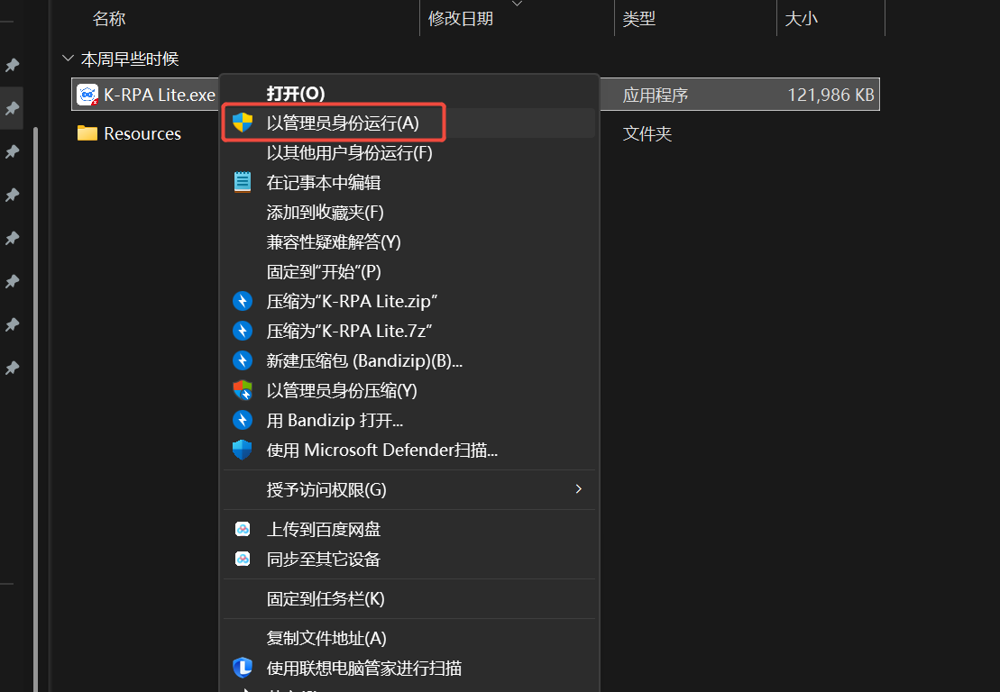
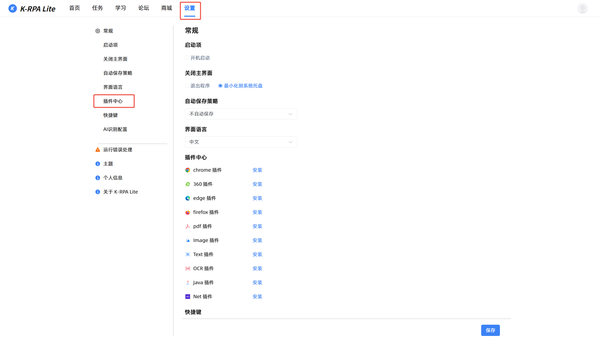

# 首次安装说明

## 1. 下载软件

在[软件下载页](https://www.kingsware.cn/krpalite/Download), 按需下载:

- 客户端&插件包 ( 首次安装推荐下载 )
- 仅客户端
- 仅插件包
- webView2环境 ( 缺失运行环境时下载, [详情](./webView2.md) )

## 2. 解压

:::tip 提示
这里以 **首次安装** 下载 **客户端&插件包** 解压做示例.
:::
 

 

## 3.第一次启动

:::tip 提示
第一次请使用有写入注册表权限的身份运行程序, 通常是**以管理员身份运行**.
:::
 

 
运行成功后会解压出程序运行的文件夹与文件.

## 4.安装浏览器插件

找到设置页面中的插件中心, 选择所需的插件, 点击安装.

安装浏览器插件时, 程序会关闭浏览器进程, 待安装完成后, 点击去启用.

 

## 5.检查插件安装是否成功

:::tip 提示
部分用户的环境插件安装成功后并不会自动打开, 所以需要用户手动开启, 下图以 Edge为例.
:::

