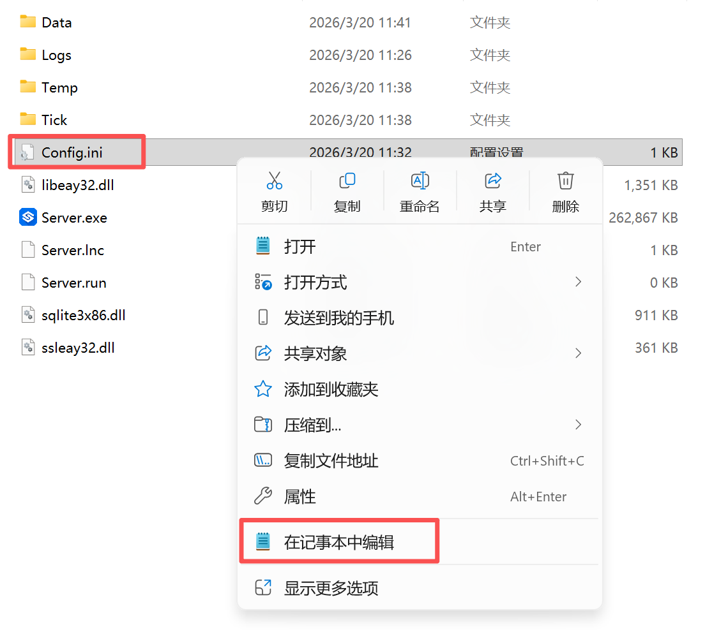
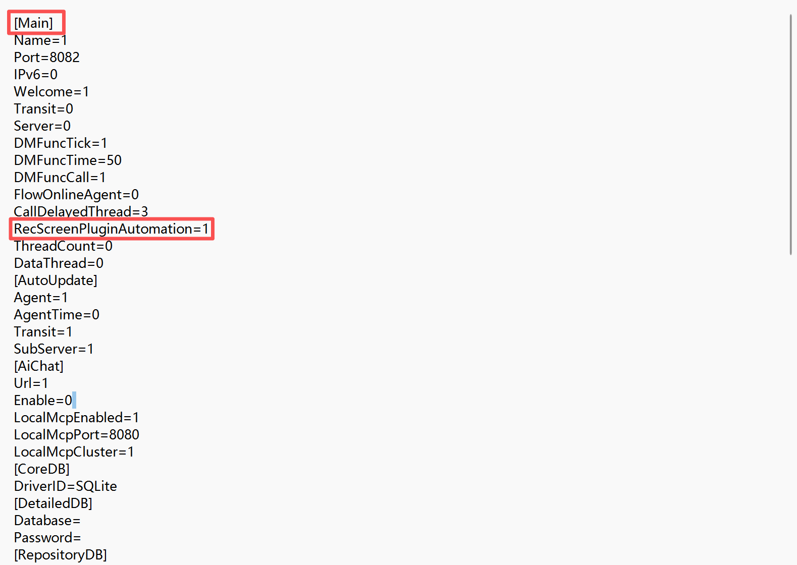
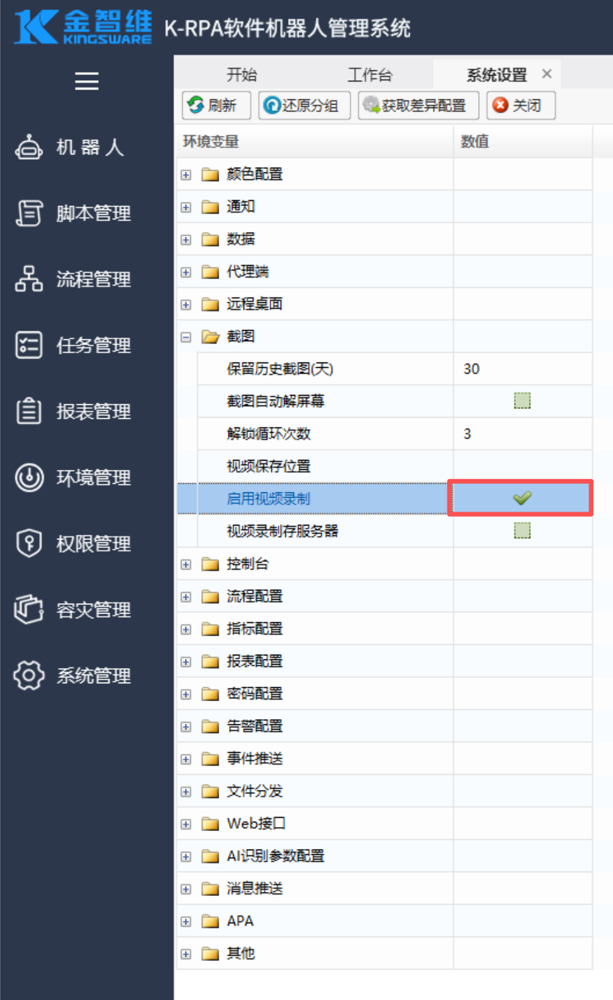
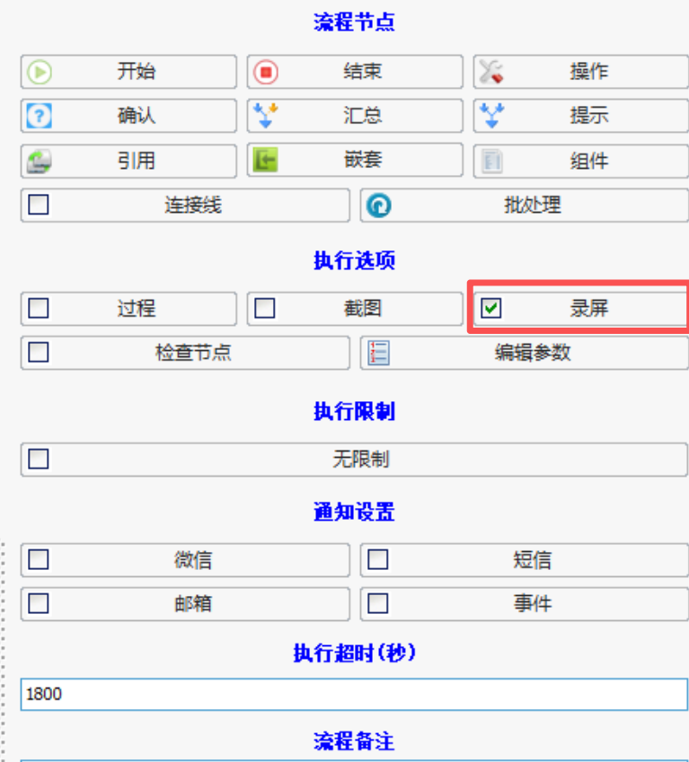

# 控制台调用lite开启屏幕录制配置说明

## 准备操作

1. 用记事本编辑server目录中的【config.ini】配置文件
  

2. 在配置未见中的【Main】分组中添加【RecScreenPluginAutomation=1】开启录屏参数。 1=开启 0=关闭
  

3. 在控制台系统设置-截图 中开启【屏幕录制】
  

4. 在执行的流程中 启用【录屏】功能
  

  ps：流程执行时间<=10秒 无法录制