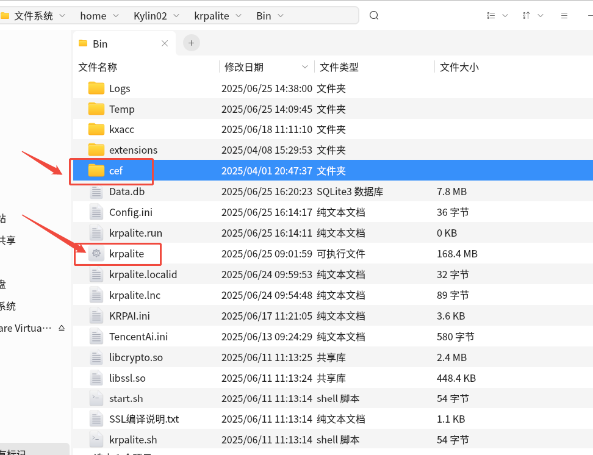

# Linux CEF 缺失解决方法

## 现象

## 原因

Linux 环境中使用 K-RPA Lite 需要 CEF 框架

## 解决方案

下载对应系统的 `CEF` zip 包解压后放在 `krpalite` 执行文件的同级目录下

下载地址: [CEF_x86](https://www.kingsware.cn/krpalite/package/cef/cef_x86.zip), [CEF_arm](https://www.kingsware.cn/krpalite/package/cef/cef_arm.zip)

