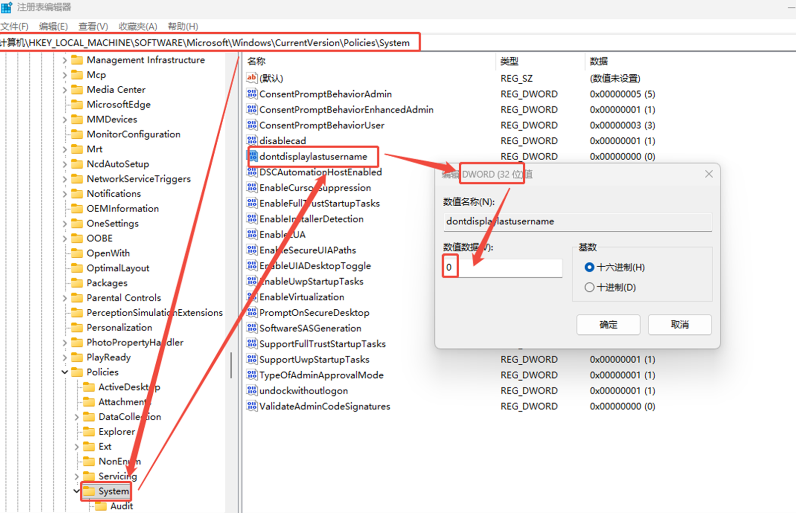

# 屏幕解锁报错解决办法

## 现象

## 原因

屏幕解锁服务启动问题

## 解决方案

1. regedit打开注册表
2. 进入路径：计算机\HKEY_LOCAL_MACHINE\SOFTWARE\Microsoft\Windows\CurrentVersion\Policies\System
3. 右侧：新建一个【DWORD(32 位)值(D)】项，命名为dontdisplaylastusername，默认数值为0
4. 再重新运行函数【屏幕解锁】就不会弹出dontdisplaylastusername的错误框了

