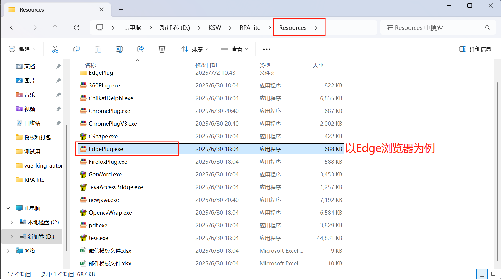
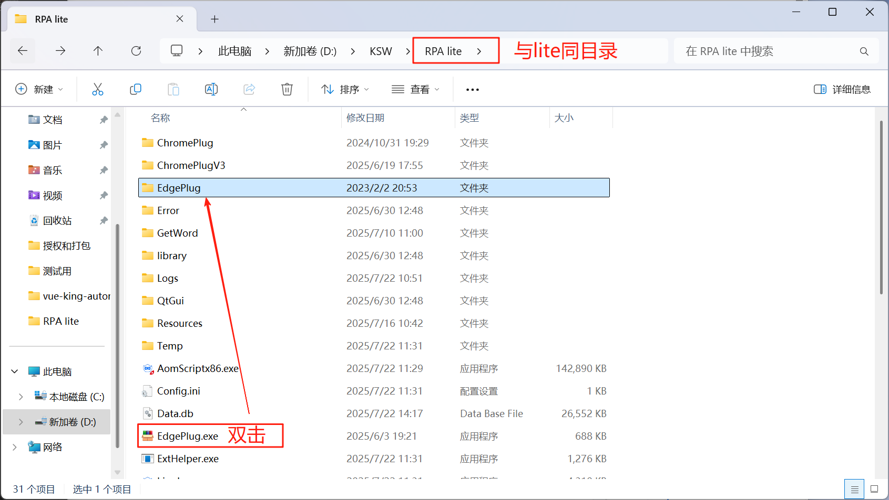
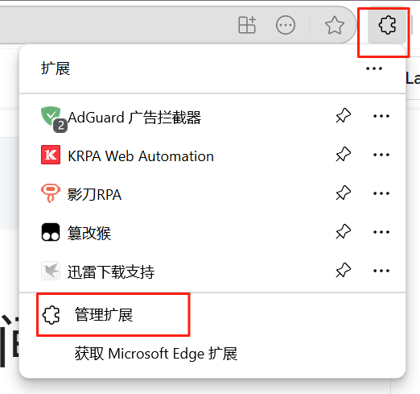
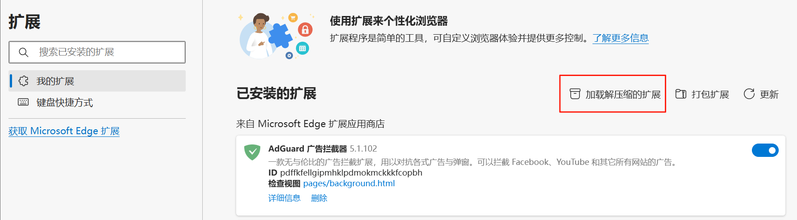
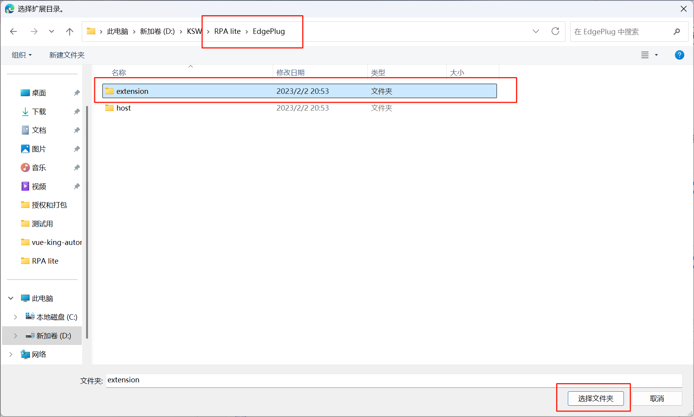

# 插件自动安装失败

## 现象

在应用中点击【安装/重新安装】之后，浏览器【管理扩展】功能下未出现该插件，或者显示已安装但无法启用

注:谷歌浏览器138之后版本 需要安装V3插件 138几138之前需要安装V2插件

## 解决方案

首先需确定，在安装插件之前，是否以管理员身份打开应用，如使用管理员打开应用之后，在应用中安装插件仍然失败，请参考以下方案

1、将Resources文件夹中的EdgePlug.exe，放至K-RPA Lite.exe同目录下，然后双击EdgePlug.exe，则会产生文件夹EdgePlug

2、进入Edge浏览器-》管理扩展-》加载解压缩的扩展，选择步骤1文件夹EdgePlug下的文件夹extension，确定

3、确定后，看看此插件是否正常开启

一般手动安装其他浏览器插件也是同样类似的操作，选择文件夹extension，即安装插件
