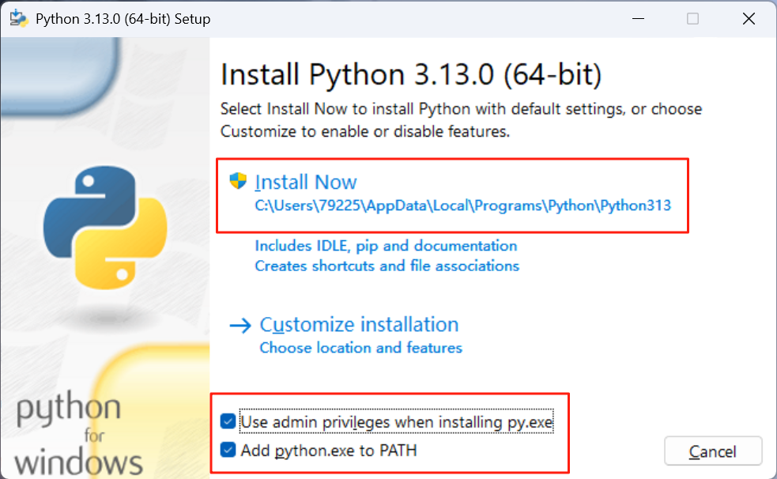
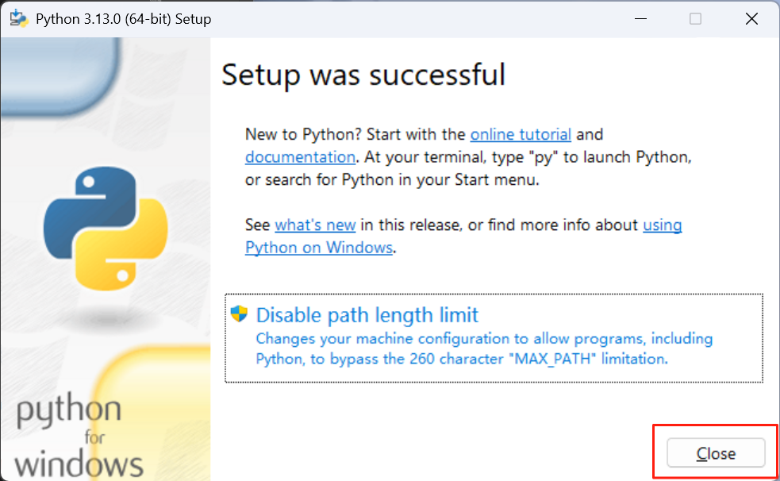
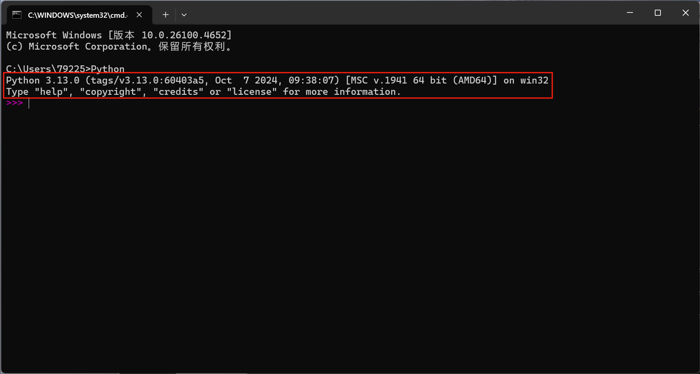

# Python安装指南

## 下载链接

Python下载地址:

[Windows安装程序 (32-bit)](https://www.python.org/ftp/python/3.13.0/python-3.13.0.exe)

[Windows安装程序 (64-bit)](https://www.python.org/ftp/python/3.13.0/python-3.13.0-amd64.exe)

[Windows安装程序 (ARM64))](https://www.python.org/ftp/python/3.13.0/python-3.13.0-arm64.exe)

注: 如果下载慢可右键 复制上方下载链接用迅雷打开
## 安装教程

1. 勾选下面两项 然后点击Install Now

2.直接点击Close

3.按Win+R 输入cmd回车

4.输入Python 回车 显示版本信息代表安装成功

