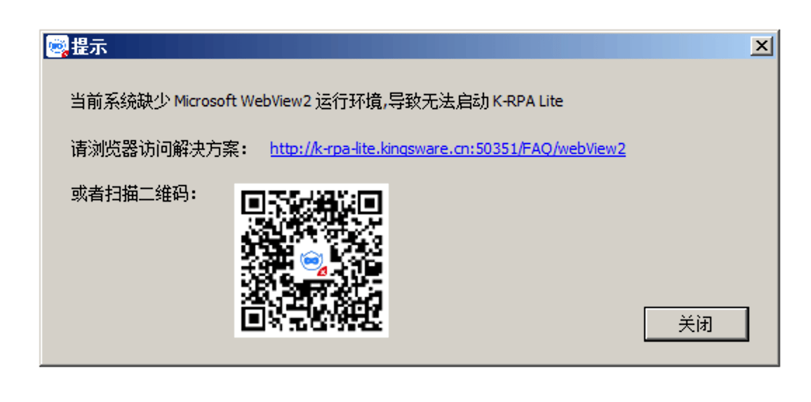
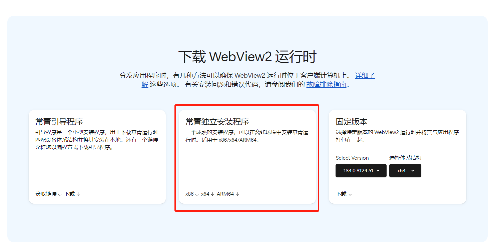
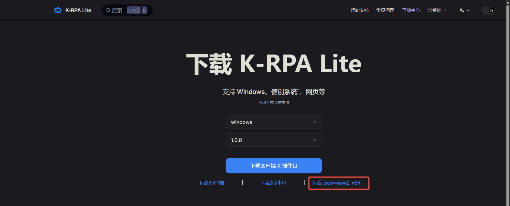
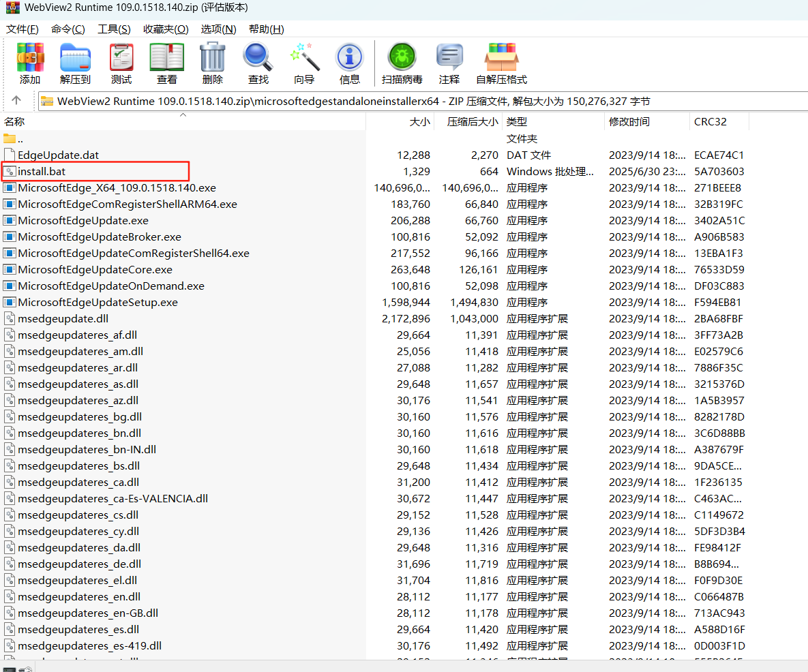

# webView2 报错解决方法

## 现象

## 原因

用户的系统缺少 Microsoft WebView2 运行环境. 这在一些企业定制的 windows 系统中是非常常见的现象.

:::tip WebView2 是什么?

WebView2 是微软推出的一个控件，允许开发者在 Windows 应用程序中嵌入基于 Chromium 的浏览器引擎，用于渲染网页内容。它是 Internet Explorer 的 WebView 控件的继任者，基于更现代的 Edge 浏览器技术。

:::

## Windows 11 设备和 Windows 10 设备

在 Windows 11 中，WebView2 运行时已内置于操作系统，任何更新至 Windows 11 的设备均可轻松使用。

绝大多数 Windows 10 设备都已安装 WebView2 运行时，少数 Windows 10 设备未安装 WebView2 运行时。 建议使用以下任一方法处理此情况：

- 前往微软官方网站下载 WebView2 运行时: [下载Microsoft Edge WebView2](https://developer.microsoft.com/zh-cn/microsoft-edge/webview2/?form=MA13LH)

  

- 或者在 [下载中心](/Download) 找到对应环境下载

  

若以上方法还不能解决您的问题, 另请参阅：

- [Windows 7 设备](./webView2#Windows%207%20%E8%AE%BE%E5%A4%87)

## Windows 7 设备

由于 Windows 7 不再受 Microsoft 支持，建议使用较旧的 WebView2 版本，并确保选择与您的 Windows 7 版本（32位或64位）匹配的安装程序。

我们提供了一个适用于 Windows 7 系统的 Microsoft Edge WebView2 运行时安装程序 (x64) 版本，版本号为 109。该版本是最后一个支持 Windows 7 的 Edge WebView2 运行时版本。

下载链接:

[下载Microsoft Edge WebView2 109](https://www.kingsware.cn/krpalite/package/webView2/Windows7/x64/WebView2%20Runtime%20109.0.1518.140.zip)

安装方式：

下载解压后双击 `install.bat` 文件即可自动安装

