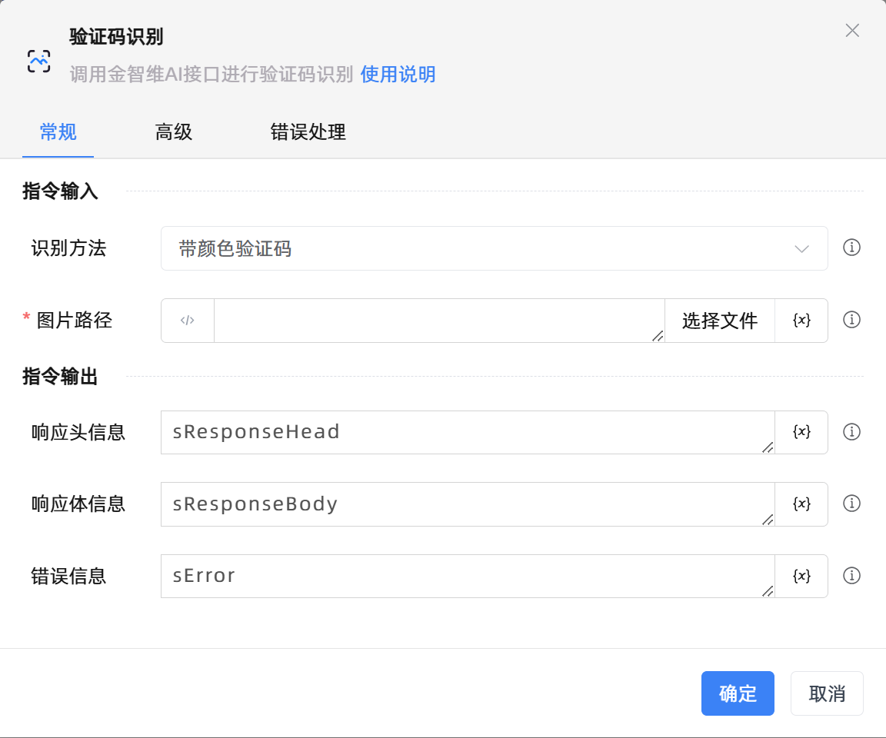

# 验证码识别

## 功能说明

:::tip 功能描述
调用金智维AI接口进行验证码识别
:::

## 配置项说明

### 常规

**指令输入**

- **识别方法**`Integer`: 选择识别方法

- **图片路径**`string`: 输入要选择的图片地址

- **标签类型**`String`: 输入正确的标签类型

- **标签**`String`: 九宫格内的事物

- **滑块图文件**`string`: 输入要选择的滑块图文件地址

- **类型**`Integer`: 获取类型

- **验证码类型**`Integer`: 输入合适的验证码类型

**指令输出**

- **响应头信息**`String`: 指定一个变量，用来保存响应头信息

- **响应体信息**`String`: 指定一个变量，用来保存响应体信息

- **错误信息**`String`: 指定一个变量，用来保存错误信息

### 高级

- **响应头类型**`array of string`: 当服务器和客户端创建的是长连接，就需要对http响应头的connection作必要的设置，默认为['Connection']

- **代理参数**`string`: 当我们的程序不能直接连到目标网络，可使用代理服务器，格式为 地址:端口

- **执行前延迟(毫秒)**`Integer`: 指令执行前等待的时间

- **超时时间(毫秒)**`Integer`: 最长等待时间(毫秒)

### 错误处理

- **打印错误日志**`Boolean`：当指令运行出错时，打印错误日志到【日志】面板。默认勾选。

- **处理方式**`Integer`：

 - **终止流程**：指令运行出错时，终止流程。

 - **忽略异常并继续执行**：指令运行出错时，忽略异常，继续执行流程。

 - **重试此指令**：指令运行出错时，重试运行指定次数指令，每次重试间隔指定时长。

## 使用示例

**流程逻辑描述：** 

## 常见错误及处理

无

## 常见问题解答

无

