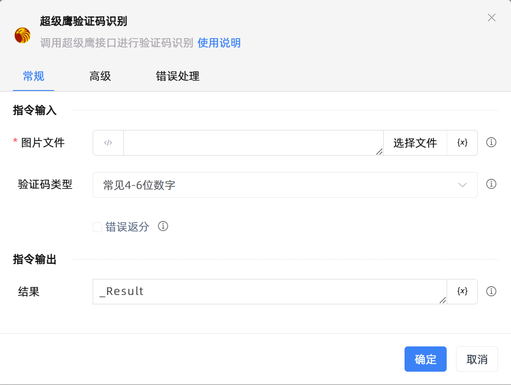

# 超级鹰验证码识别
- 适用系统: windows / 信创

## 功能说明

:::tip 功能描述
调用超级鹰接口进行验证码识别
:::

## 配置项说明

### 常规

**指令输入**

- **图片文件**`string`: 输入或选择图片路径

- **验证码类型**`Integer`: 选择待识别的验证码类型

- **错误返分**`Boolean`: 向服务器报告某个图片ID的识别结果是错误的，服务器把题分或次数返还给用户

**指令输出**

- **结果**`string`: 指定一个变量，用来保存结果

### 高级

- **代理参数**`string`: 当我们的程序不能直接连到目标网络但对方安装了代理服务器，格式为 地址:端口

- **用户账号**`string`: 用户账号，默认读取配置文件

- **用户密码**`string`: 用户密码，默认读取配置文件

- **软件标识**`string`: 软件ID，默认读取配置文件

- **执行前的延迟(毫秒)**`Integer`: 指令执行前的等待时间

- **超时时间(毫秒)**`Integer`: 最长等待时间(毫秒)

### 错误处理

- **打印错误日志**`Boolean`：当指令运行出错时，打印错误日志到【日志】面板。默认勾选。

- **处理方式**`Integer`：

 - **终止流程**：指令运行出错时，终止流程。

 - **忽略异常并继续执行**：指令运行出错时，忽略异常，继续执行流程。

 - **重试此指令**：指令运行出错时，重试运行指定次数指令，每次重试间隔指定时长。

## 常见问题解答

  - 需要在超级鹰官网注册账号以及软件ID https://www.chaojiying.com/user/reg/ 
  - 在高级中填写账号密码以及软件ID
  - 或创建一个 VerCode.ini 文件 将以下内容复制进去 并填写自己账号密码和id 就不需要再高级中填写了  
  [ChaoJiYing]  
  Account=账号  
  Passwd=密码  
  SoftID=软件ID

