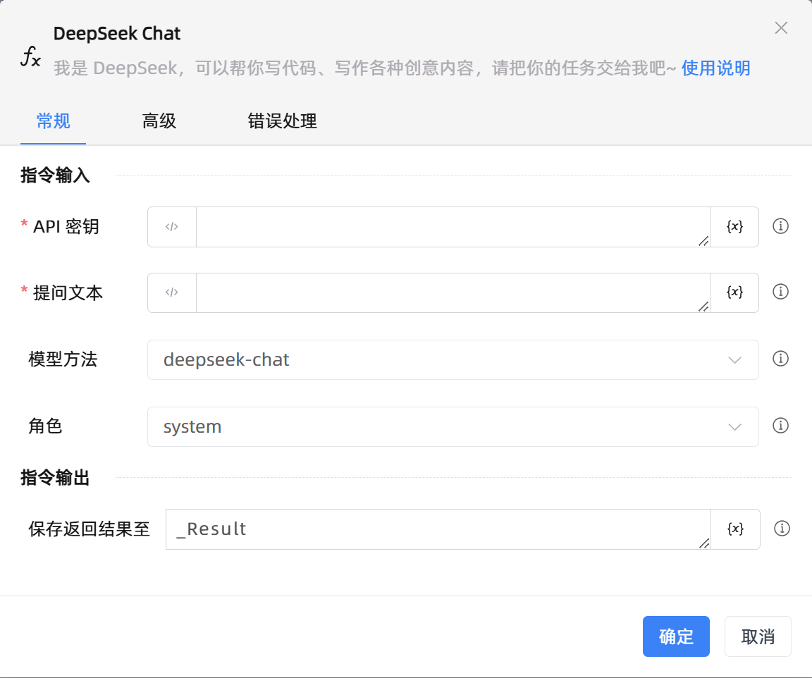

# DeepSeek Chat

## 功能说明

:::tip 功能描述
我是 DeepSeek，可以帮你写代码、写作各种创意内容，请把你的任务交给我吧~
:::

## 配置项说明

### 常规

**指令输入**

- **API 密钥**`string`: 输入deepseek API keys。API keys获取方式：登录deepseek开放平台(https://platform.deepseek.com/)，创建API keys

- **提问文本**`string`: 你向deepseek 输入的信息

- **模型方法**`Integer`: 通常选用DeepSeek-Chat，选择模型方法【DeepSeek-Chat：出内容更自由、多样化，可能包含幽默、情感等元素。答案可能不够精确，但更注重交互体验。】【DeepSeek-Reasoner：输出内容更严谨、精确，注重逻辑正确性。答案通常基于事实或规则，较少包含主观内容。】

- **角色**`Integer`: 通常选用Assistant，请选择自己需要的角色【System：管理对话流程和上下文。】【User：发起对话并提供输入。】【Assistant：直接与用户交互，生成自然语言响应。】【Tool：执行特定任务，返回结构化结果。】

**指令输出**

- **保存返回结果至**`string`: 指定一个变量，用于保存返回的文本

### 高级

- **执行前的延迟(毫秒)**`Integer`: 指令执行前的等待时间

- **超时时间(毫秒)**`Integer`: 最长等待时间(毫秒)

### 错误处理

- **打印错误日志**`Boolean`：当指令运行出错时，打印错误日志到【日志】面板。默认勾选。

- **处理方式**`Integer`：

 - **终止流程**：指令运行出错时，终止流程。

 - **忽略异常并继续执行**：指令运行出错时，忽略异常，继续执行流程。

 - **重试此指令**：指令运行出错时，重试运行指定次数指令，每次重试间隔指定时长。

## 使用示例
无

## 常见错误及处理

无

## 常见问题解答

无

