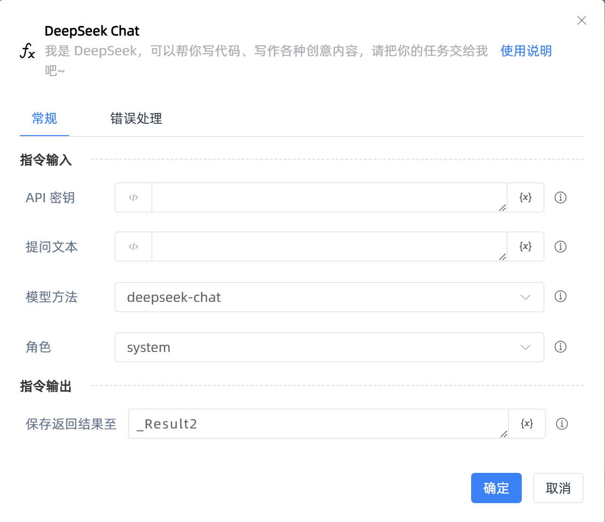
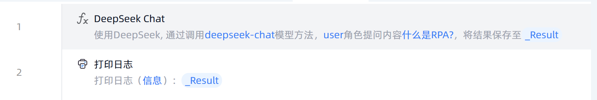

# DeepSeek Chat

## 功能说明

:::tip 功能描述
可通过自然语言对话让deepseek完成写作、代码生成、对话、翻译等任务
:::

## 配置项说明

### 常规

**指令输入**

- **API密钥**`string`: 输入deepseek API keys。API keys获取方式：登录[deepseek开放平台](https://platform.deepseek.com/)，创建API keys
- **提问文本**`string`: 你向deepseek 输入的信息
- **模型方法**`Integer`: 选择合适的模型方法，通常选用DeepSeek-Chat
  - DeepSeek-Chat：输出内容更自由、多样化，可能包含幽默、情感等元素。答案可能不够精确，但更注重交互体验。
  - DeepSeek-Reasoner：输出内容更严谨、精确，注重逻辑正确性。答案通常基于事实或规则，较少包含主观内容。

- **角色**`Integer`: 选择角色，用于区分对话中的不同参与者及其作用
  - System: 该角色用于设置对话的上下文或提供全局指令。使用场景：初始化对话时，定义助手的行为或规则；提供背景信息或约束条件；控制对话的流程或风格。
  -  User: 该角色代表对话中的用户，即向助手提出问题或发出指令的人。使用场景：用户输入问题或请求；用户提供额外的上下文信息。
  - Assistant:  该角色代表对话中的助手，即响应用户问题或执行指令的 AI 模型。使用场景：助手回答用户的问题；助手执行任务或提供建议。
  - Tool：执行特定任务，返回结构化结果。

**指令输出**

- **保存返回结果至**`string`: 指定一个变量，用于保存返回的文本

### 错误处理

- **打印错误日志**`Boolean`：当指令运行出错时，打印错误日志到【日志】面板。默认勾选。

- **处理方式**`Integer`：

 - **终止流程**：指令运行出错时，终止流程。

 - **忽略异常并继续执行**：指令运行出错时，忽略异常，继续执行流程。

 - **重试此指令**：指令运行出错时，重试运行指定次数指令，每次重试间隔指定时长。

## 使用示例

**流程逻辑描述：** 使用【DeepSeek Chat】指令向DeepSeek提问内容 --> 使用【打印日志】指令打印DeepSeek返回的结果

## 常见错误及处理

无

## 常见问题解答

无

