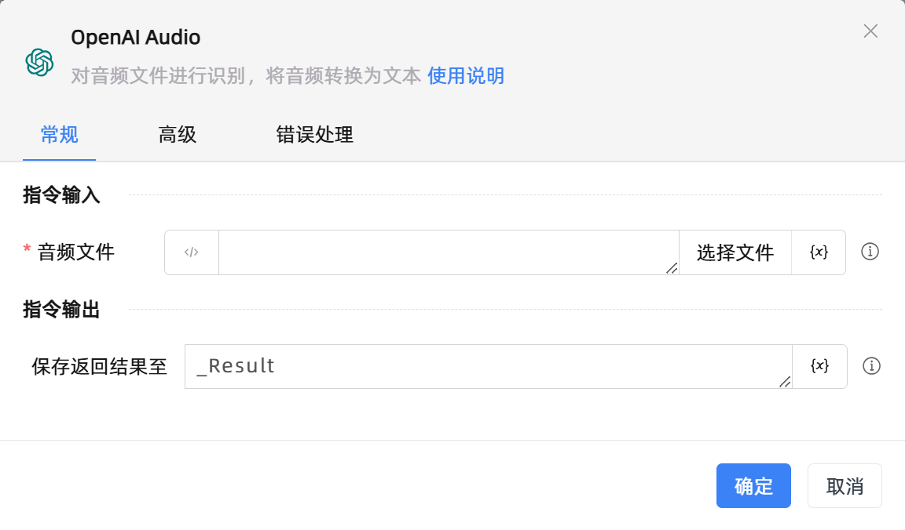

# OpenAI Audio

## 功能说明

:::tip 功能描述
对音频文件进行识别，将音频转换为文本
:::

## 配置项说明

### 常规

**指令输入**

- **音频文件**`string`: 输入音频文件的路径。文件类型支持m4a、mp3、webm、mp4、mpga、wav、mpeg、ogg、oga、flac格式

**指令输出**

- **保存返回结果至**`string`: 指定一个变量，用于保存返回的文本

### 高级

- **代理参数**`string`: 当我们的程序不能直接连到目标网络但对方安装了代理服务器，格式为 地址:端口

- **执行前的延迟(毫秒)**`Integer`: 指令执行前的等待时间

- **超时时间(毫秒)**`Integer`: 最长等待时间(毫秒)

### 错误处理

- **打印错误日志**`Boolean`：当指令运行出错时，打印错误日志到【日志】面板。默认勾选。

- **处理方式**`Integer`：

 - **终止流程**：指令运行出错时，终止流程。

 - **忽略异常并继续执行**：指令运行出错时，忽略异常，继续执行流程。

 - **重试此指令**：指令运行出错时，重试运行指定次数指令，每次重试间隔指定时长。

## 使用示例

**流程逻辑描述：** 

## 常见错误及处理

无

## 常见问题解答

无

