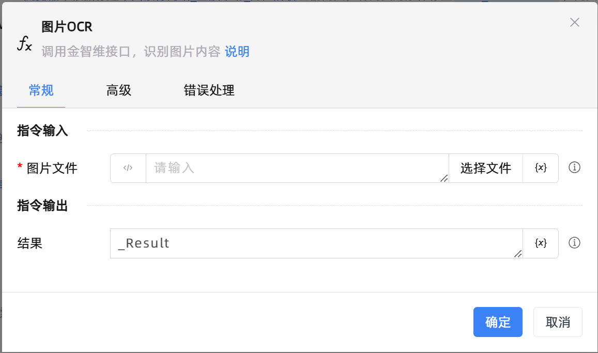

# 图片OCR

## 功能说明

:::tip 功能描述
调用金智维接口，识别图片内容
:::

## 配置项说明

### 常规

**指令输入**

- **图片文件**`string`: 输入或选择图片文件路径

**指令输出**

- **结果**`string`: 指定一个变量，用来保存识别结果

### 高级

- **语言模型**`Integer`: 加载models目录中的引擎配置文件，可切换不同语言的配置。

- **纠正文本方向**`Boolean`: 填true时启用方向分类，识别倾斜或倒置的文本。可能降低识别速度。

- **限制图像边长**`Integer`: 将边长大于该值的图片进行压缩。较低的限制值可以提高识别速度，较高的限制可以提高大图的识别精度。

- **排版解析**`Integer`: 按什么方式，解析和排序图片中的文字块。

- **数据返回格式**`Integer`: 返回值字典中，data表示按什么格式表示OCR结果数据。dict表示含有位置等信息的详细字典，text表示仅返回识别文本。

- **忽略区域**`string`: 处于任意一个忽略区域内的OCR文本块将被舍弃。每个忽略区域用矩形坐标表示。每一项为[[左上角x,y],[右下角x,y]]

- **执行前的延迟(毫秒)**`Integer`: 指令执行前的等待时间

- **超时时间(毫秒)**`Integer`: 最长等待时间(毫秒)

### 错误处理

- **打印错误日志**`Boolean`：当指令运行出错时，打印错误日志到【日志】面板。默认勾选。

- **处理方式**`Integer`：

 - **终止流程**：指令运行出错时，终止流程。

 - **忽略异常并继续执行**：指令运行出错时，忽略异常，继续执行流程。

 - **重试此指令**：指令运行出错时，重试运行指定次数指令，每次重试间隔指定时长。

## 使用示例
无

## 常见错误及处理

无

## 常见问题解答

无

