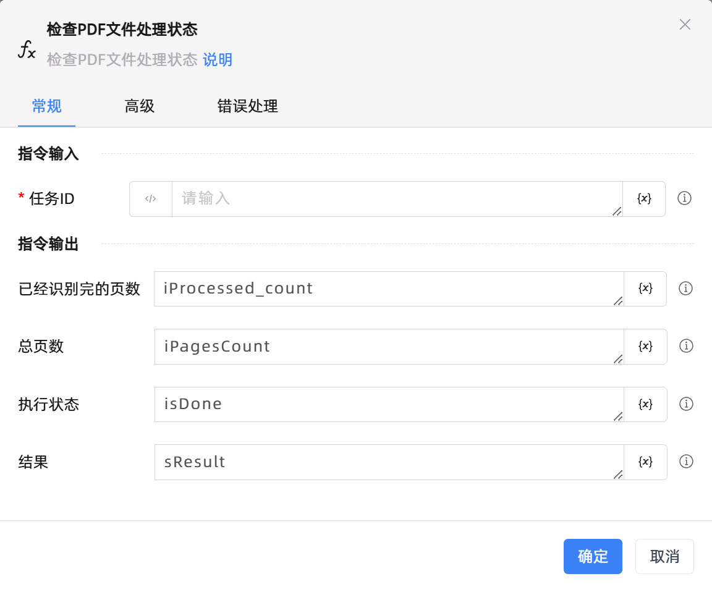

# 检查PDF文件处理状态
- 适用系统: windows / 信创

## 功能说明

:::tip 功能描述
检查PDF文件处理状态
:::

## 配置项说明

### 常规

**指令输入**

- **任务ID**`string`: 文件上传接口执行成功后，返回的任务ID。

**指令输出**

- **已经识别完的页数**`Integer`: 已经识别完的页数

- **总页数**`Integer`: 总页数

- **执行状态**`Boolean`: true表示任务已结束（state可能为success或failure），false表示任务仍在进行中

- **结果**`String`: 指定一个变量，用来保存识别结果

### 高级

- **包含结果**`Boolean`: true ：返回值中包含识别结果；false （默认）：返回值中不包含识别结果，只有简略的任务状态信息。

- **结果条目**`Boolean`: true （默认）：返回未读过的识别结果条目；false ：返回全部识别结果条目。

- **数据返回格式**`Integer`: 返回值字典中，data表示按什么格式表示OCR结果数据。dict表示含有位置等信息的详细字典，text表示仅返回识别文本。

- **执行前的延迟(毫秒)**`Integer`: 指令执行前的等待时间

- **超时时间(毫秒)**`Integer`: 最长等待时间(毫秒)

### 错误处理

- **打印错误日志**`Boolean`：当指令运行出错时，打印错误日志到【日志】面板。默认勾选。

- **处理方式**`Integer`：

 - **终止流程**：指令运行出错时，终止流程。

 - **忽略异常并继续执行**：指令运行出错时，忽略异常，继续执行流程。

 - **重试此指令**：指令运行出错时，重试运行指定次数指令，每次重试间隔指定时长。

## 使用示例
无

## 常见错误及处理

无

## 常见问题解答

无

