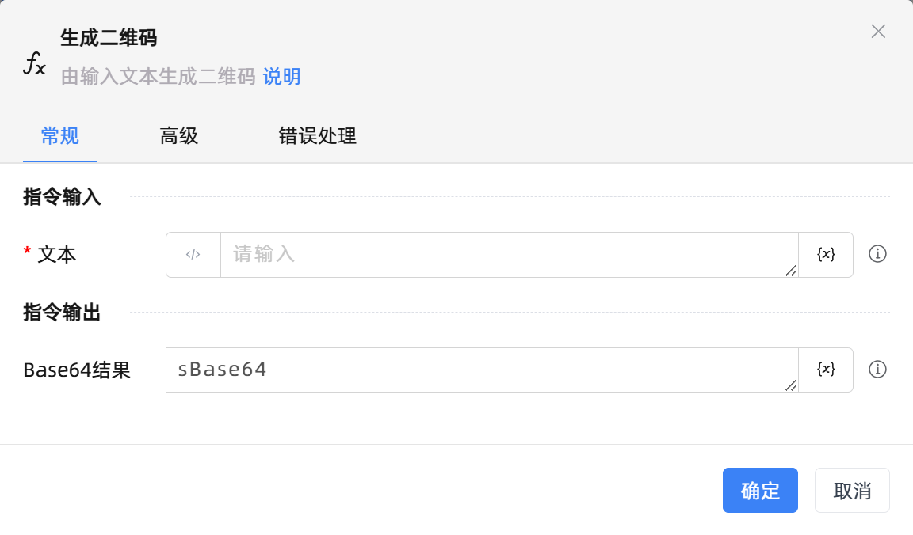

# 生成二维码
- 适用系统: windows / 信创

## 功能说明

:::tip 功能描述
由输入文本生成二维码
:::

## 配置项说明

### 常规

**指令输入**

- **文本**`string`: 二维码文本。

**指令输出**

- **Base64结果**`String`: 指定一个变量，用来保存识别Base64结果

### 高级

- **二维码码格式**`Integer`: 二维码格式，一般用QRCode即可。

- **生成图像宽度**`Integer`: 默认 0 为自动设为最小宽度。

- **生成图像高度**`Integer`: 默认 0 为自动设为最小高度。

- **quietZone **`Boolean`: 

- **ecLevel **`Integer`: 

- **执行前的延迟(毫秒)**`Integer`: 指令执行前的等待时间

- **超时时间(毫秒)**`Integer`: 最长等待时间(毫秒)

### 错误处理

- **打印错误日志**`Boolean`：当指令运行出错时，打印错误日志到【日志】面板。默认勾选。

- **处理方式**`Integer`：

 - **终止流程**：指令运行出错时，终止流程。

 - **忽略异常并继续执行**：指令运行出错时，忽略异常，继续执行流程。

 - **重试此指令**：指令运行出错时，重试运行指定次数指令，每次重试间隔指定时长。

## 使用示例
无

## 常见错误及处理

无

## 常见问题解答

无

