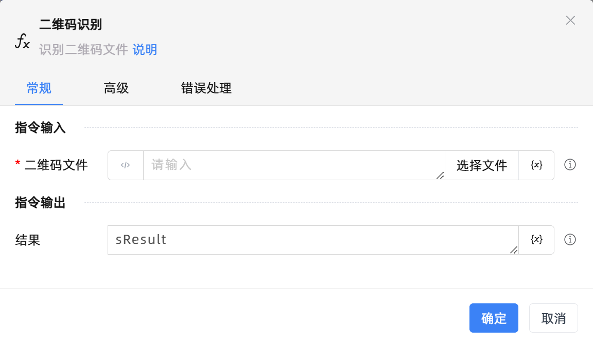

# 二维码识别

## 功能说明

:::tip 功能描述
识别二维码文件
:::

## 配置项说明

### 常规

**指令输入**

- **二维码文件**`string`: 输入或选择二维码文件路径。

**指令输出**

- **结果**`String`: 指定一个变量，用来保存识别结果

### 高级

- **中值滤波器的大小**`Integer`: true ：取值范围：1~9的奇数。默认不进行滤波。

- **锐度增强因子**`Integer`: 取值范围：0.1~10.0。默认不调整锐度。

- **对比度增强因子**`Integer`: 取值范围：0.1~10.0。大于1增强对比度，小于1但大于0减少对比度，1保持原样。默认不调整对比度。

- **灰度**`Boolean`: true为转换，false为不转换。默认为false。

- **二值化阈值**`Integer`: 用于灰度图像的二值化处理。取值范围：0~255 整数。只有当 灰度为真 时，此参数才生效。默认为false。

- **执行前的延迟(毫秒)**`Integer`: 指令执行前的等待时间

- **超时时间(毫秒)**`Integer`: 最长等待时间(毫秒)

### 错误处理

- **打印错误日志**`Boolean`：当指令运行出错时，打印错误日志到【日志】面板。默认勾选。

- **处理方式**`Integer`：

 - **终止流程**：指令运行出错时，终止流程。

 - **忽略异常并继续执行**：指令运行出错时，忽略异常，继续执行流程。

 - **重试此指令**：指令运行出错时，重试运行指定次数指令，每次重试间隔指定时长。

## 使用示例
无

## 常见错误及处理

无

## 常见问题解答

无

