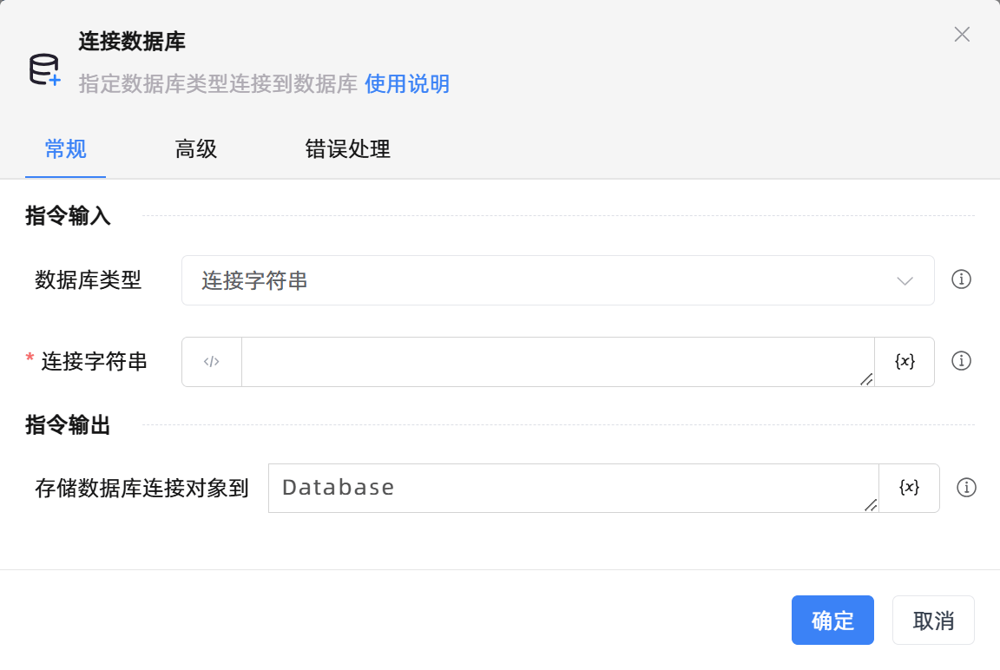

# 连接数据库
- 适用系统: windows / 信创

## 功能说明

:::tip 功能描述
指定数据库类型连接到数据库
:::

## 配置项说明

### 常规

**指令输入**

- **数据库类型**`Integer`: 指定一个数据库连接类型

- **连接字符串**`string`: 填写数据库连接字符串

- **地址**`string`: 填写数据库连接地址

- **端口**`Integer`: 填写数据库连接端口

- **数据库**`string`: 填写数据库名称

- **用户名**`string`: 填写数据库用户名

- **密码**`string`: 填写数据库密码

- **数据库编码**`string`: 填写数据库编码

- **登录方式**`Integer`: 设置一个登录方式

**指令输出**

- **存储数据库连接对象到**`TDatabase`: 指定一个变量名，该变量用于存储数据库连接对象

### 高级

- **执行前的延迟(毫秒)**`Integer`: 指令执行前的等待时间

### 错误处理

- **打印错误日志**`Boolean`：当指令运行出错时，打印错误日志到【日志】面板。默认勾选。

- **处理方式**`Integer`：

 - **终止流程**：指令运行出错时，终止流程。

 - **忽略异常并继续执行**：指令运行出错时，忽略异常，继续执行流程。

 - **重试此指令**：指令运行出错时，重试运行指定次数指令，每次重试间隔指定时长。

## 使用示例
无

## 常见错误及处理

无

## 常见问题解答

无

