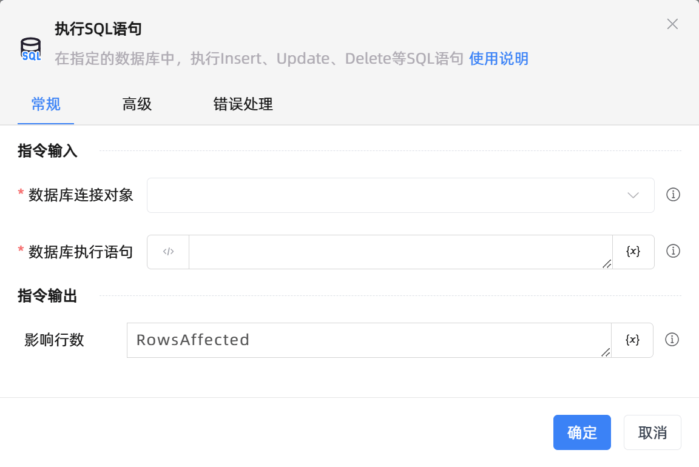

# 执行SQL语句
- 适用系统: windows / 信创

## 功能说明

:::tip 功能描述
在指定的数据库中，执行Insert、Update、Delete等SQL语句
:::

## 配置项说明

### 常规

**指令输入**

- **数据库连接对象**`TDatabase`: 设置数据库连接对象

- **数据库执行语句**`string`: 填写数据库执行语句

**指令输出**

- **影响行数**`Integer`: 指定一个变量名称，该变量用于存储数据库执行影响行数

### 高级

- **执行前的延迟(毫秒)**`Integer`: 指令执行前的等待时间

### 错误处理

- **打印错误日志**`Boolean`：当指令运行出错时，打印错误日志到【日志】面板。默认勾选。

- **处理方式**`Integer`：

 - **终止流程**：指令运行出错时，终止流程。

 - **忽略异常并继续执行**：指令运行出错时，忽略异常，继续执行流程。

 - **重试此指令**：指令运行出错时，重试运行指定次数指令，每次重试间隔指定时长。

## 使用示例
无

## 常见错误及处理

无

## 常见问题解答

无

