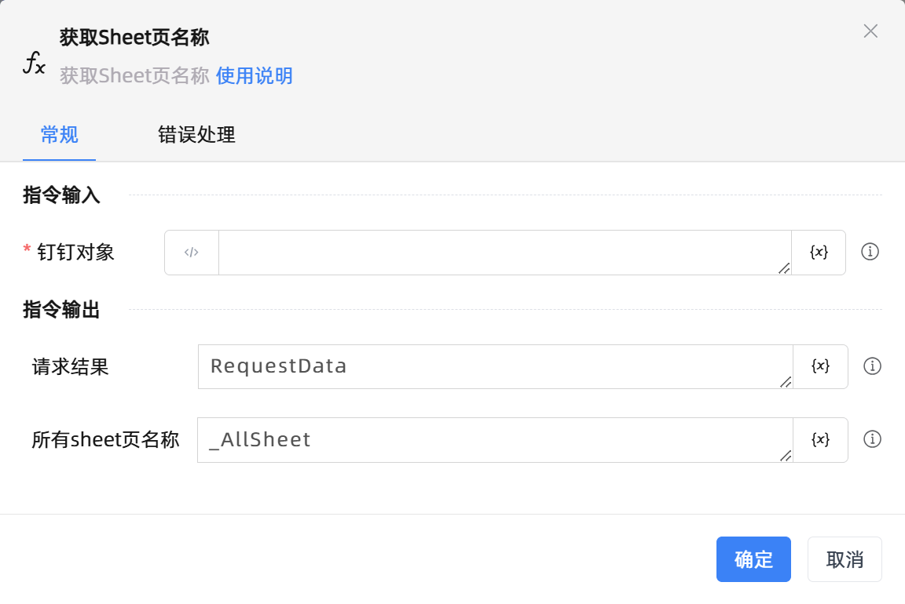

# 获取Sheet页名称

## 功能说明

:::tip 功能描述
获取Sheet页名称
:::

## 配置项说明

### 常规

**指令输入**

- **钉钉对象**`TDingTalkWorkbook`: 由建立钉钉表格连接返回的钉钉对象

**指令输出**

- **请求结果**`String`: 返回所有 sheet 页名称和工作表ID

- **所有sheet页名称**`TList<String>`: 返回所有 sheet 页名称

### 错误处理

- **打印错误日志**`Boolean`：当指令运行出错时，打印错误日志到【日志】面板。默认勾选。

- **处理方式**`Integer`：

 - **终止流程**：指令运行出错时，终止流程。

 - **忽略异常并继续执行**：指令运行出错时，忽略异常，继续执行流程。

 - **重试此指令**：指令运行出错时，重试运行指定次数指令，每次重试间隔指定时长。

## 使用示例

**流程逻辑描述：** 

## 常见错误及处理

无

## 常见问题解答

无

