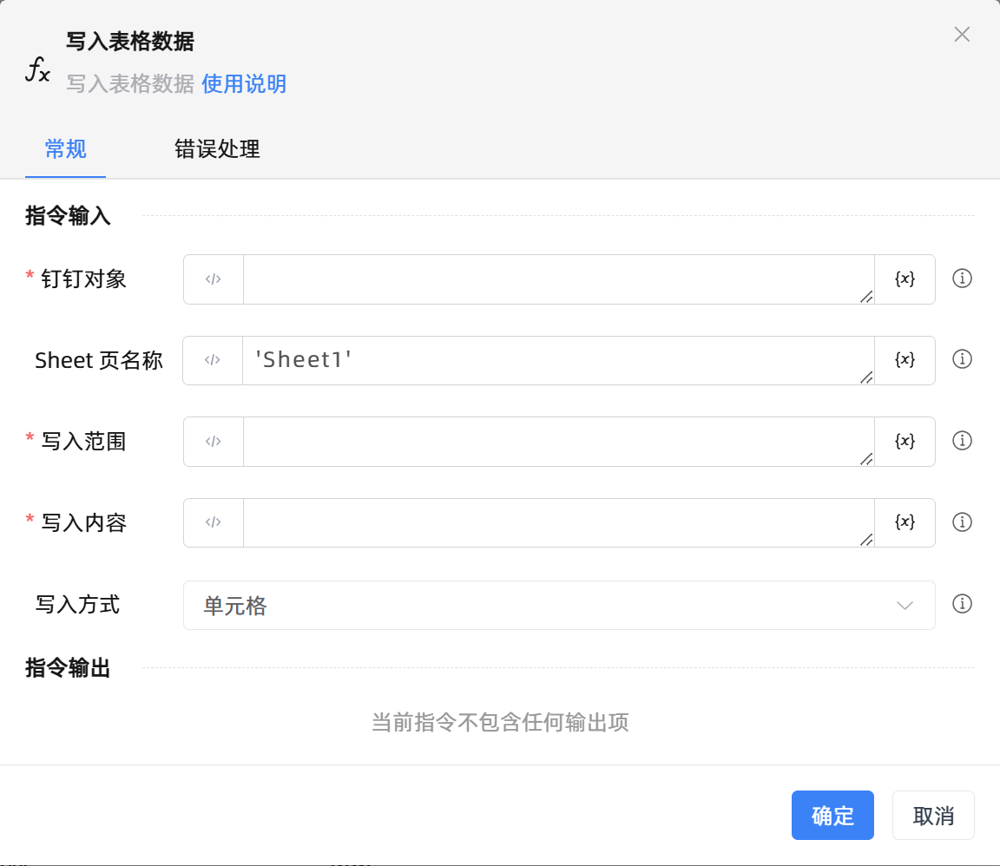

# 写入表格数据
- 适用系统: windows

## 功能说明

:::tip 功能描述
写入表格数据
:::

## 配置项说明

### 常规

**指令输入**

- **钉钉对象**`TDingTalkWorkbook`: 由建立钉钉表格连接返回的钉钉对象

- **Sheet 页名称**`String`: 默认为Sheet1页, 建议填写对应的 sheet 页

- **写入范围**`String`: 根据写入方式填写写入区域, 如, 行对应 1, 列对应 B, 区域对应左上角单元格 A1

- **写入内容**`String`: 写入表格的数据内容

- **写入方式**`Integer`: 单元格, 行, 列, 区域

**指令输出**

当前指令无输出

### 错误处理

- **打印错误日志**`Boolean`：当指令运行出错时，打印错误日志到【日志】面板。默认勾选。

- **处理方式**`Integer`：

 - **终止流程**：指令运行出错时，终止流程。

 - **忽略异常并继续执行**：指令运行出错时，忽略异常，继续执行流程。

 - **重试此指令**：指令运行出错时，重试运行指定次数指令，每次重试间隔指定时长。

## 使用示例
无

## 常见错误及处理

无

## 常见问题解答

无

