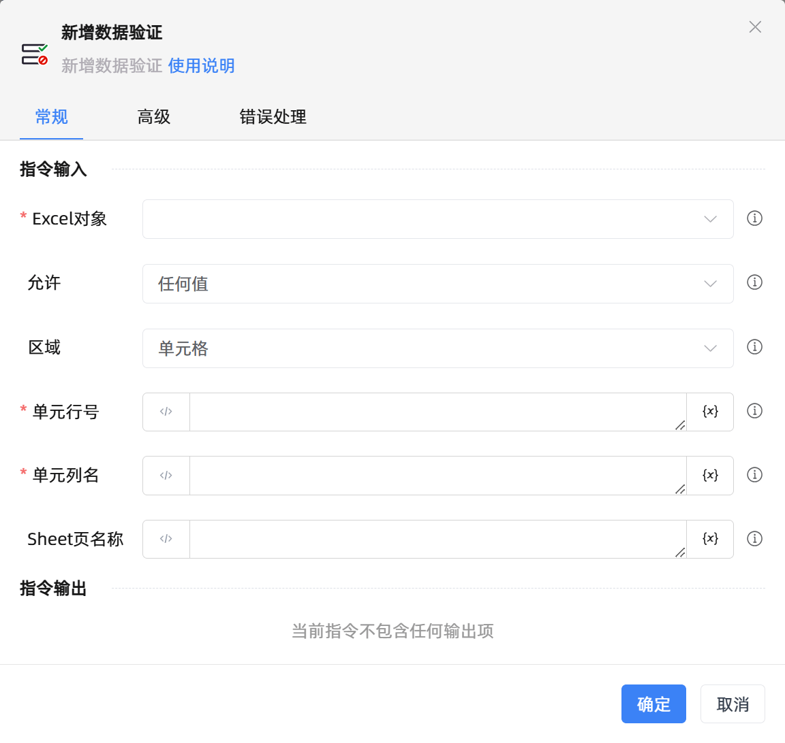

# 新增数据验证

## 功能说明

:::tip 功能描述
新增数据验证
:::

## 配置项说明

### 常规

**指令输入**

- **Excel对象**`TWorkbookApplication`: 输入一个通过函数'打开或新建Excel'/'获取当前激活的Excel对象'存储的Excel对象

- **允许**`Integer`: 允许

- **忽略空值**`Boolean`: 是否忽略空值

- **提供下拉箭头**`Boolean`: 提供下拉箭头

- **数据**`Integer`: 设置数据计算方式

- **最小值**`Integer`: 最小值

- **最大值**`Integer`: 最大值

- **来源**`string`: 来源

- **开始日期**`string`: 开始日期

- **结束日期**`string`: 结束日期

- **开始时间**`string`: 开始时间

- **结束时间**`string`: 结束时间

- **公式**`string`: 公式

- **区域**`Integer`: 指定数据验证的范围

- **单元行号**`Integer`: 指定行号，-n表示倒数第n行

- **单元列名**`string`: 指定列名(支持A或1)，-n表示倒数第n列

- **开始行号**`Integer`: 指定行号，-n表示倒数第n行

- **开始列名**`string`: 指定列名(支持A或1)，-n表示倒数第n列

- **结束行号**`Integer`: 指定行号，-n表示倒数第n行

- **结束列名**`string`: 指定列名(支持A或1)，-n表示倒数第n列

- **行号**`Integer`: 指定行号，-n表示倒数第n行

- **列名**`string`: 指定列名(支持A或1)，-n表示倒数第n列

- **Sheet页名称**`string`: 工作表名称

**指令输出**

当前指令无输出

### 高级

- **执行前的延迟(毫秒)**`Integer`: 指令执行前的等待时间

### 错误处理

- **打印错误日志**`Boolean`：当指令运行出错时，打印错误日志到【日志】面板。默认勾选。

- **处理方式**`Integer`：

    - **终止流程**：指令运行出错时，终止流程。

    - **忽略异常并继续执行**：指令运行出错时，忽略异常，继续执行流程。

    - **重试此指令**：指令运行出错时，重试运行指定次数指令，每次重试间隔指定时长。

## 使用示例
无

## 常见错误及处理

无

## 常见问题解答

无

