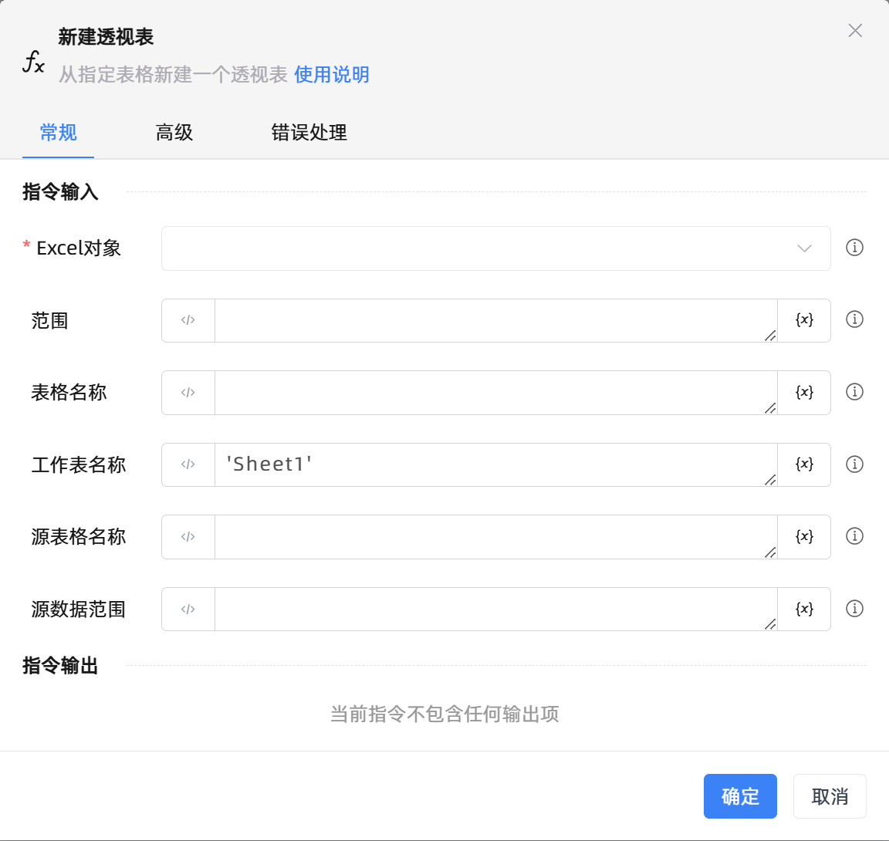

# 新建透视表

## 功能说明

:::tip 功能描述
通过指定源数据范围或表格名称，在指定工作表的指定范围内创建一个数据透视表。
:::

## 指令输入

- **Excel对象**`TWorkbookApplication`: 
    - 输入一个通过函数'打开或新建Excel'/'获取当前激活的Excel对象'存储的Excel对象

- **范围**`string`: 
    - 新建透视表的位置范围。如`E3`或`E3:G5`

- **表格名称**`string`: 
    - 新建的数据透视表名称

- **工作表名称**`string`: 
    - 数据透视表所在的工作表名称

- **源表格名称**`string`: 
    - 如果数据透视表的数据来源为表格，填写源表格名称。例如，如果数据来源是表格`Table 1`，则应填写该表格名称。

- **源数据范围**`string`: 
    - 如果数据来源是指定的区域，而不是表格名称，填写源数据的范围。例如，A1:B6表示透视表数据的来源范围。此参数是可选的，当既提供源表格名称又提供源数据范围时，优先使用源表格名称。

## 使用示例
无

