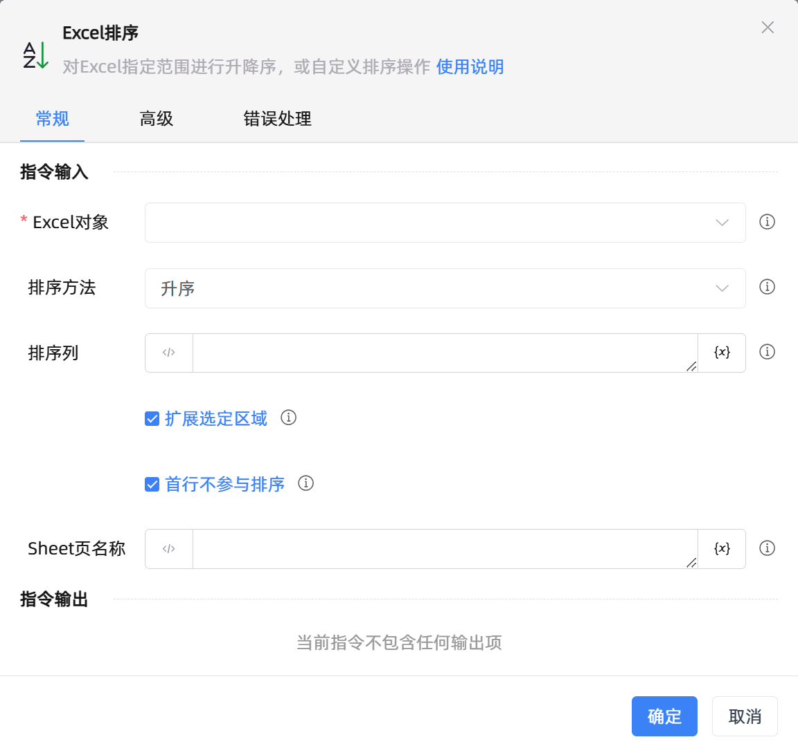

# Excel排序

## 功能说明

:::tip 功能描述
对Excel指定列做升序、降序，或者指定区域做自定义排序操作
:::

## 配置项说明

### 常规

**指令输入**

- **Excel对象**`TWorkbookApplication`: 输入一个通过函数'打开或新建Excel'/'获取当前激活的Excel对象'获得的Excel对象

- **排序方法**`Integer`: 可选择排序的方式

- **排序列**`string`: 输入列名(支持A或1)，多列用A,B,C或A:C，-n表示倒数第n列

- **扩展选定区域**`Boolean`: 扩展选定区域

- **首行不参与排序**`Boolean`: 若勾选，则首行不参与排序

- **自定义序列**`string`: 自定义序列,如：Sun,Mon,Tue,Wed,Thu,Fri,Sat

- **列**`string`: 输入列名(支持A或1)，多列用A,B,C或A:C，-n表示倒数第n列

- **区域**`Integer`: 选择排序区域

- **起始行号**`Integer`: 行号。从1开始

- **起始列名**`string`: 列名。从A开始

- **结束行号**`Integer`: 行号。从1开始

- **结束列名**`string`: 列名。从A开始

- **行号**`Integer`: 行号。从1开始

- **列名**`string`: 列名。从A开始

- **Sheet页名称**`string`: 工作表名称

**指令输出**

当前指令无输出

### 高级

- **执行前延迟(毫秒)**`Integer`: 指令执行前等待的时间

### 错误处理

- **打印错误日志**`Boolean`：当指令运行出错时，打印错误日志到【日志】面板。默认勾选。

- **处理方式**`Integer`：

 - **终止流程**：指令运行出错时，终止流程。

 - **忽略异常并继续执行**：指令运行出错时，忽略异常，继续执行流程。

 - **重试此指令**：指令运行出错时，重试运行指定次数指令，每次重试间隔指定时长。

## 使用示例

**流程逻辑描述：** 

## 常见错误及处理

无

## 常见问题解答

无

