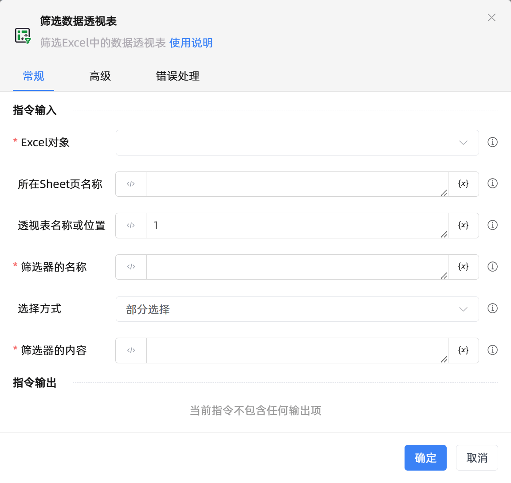

# 筛选数据透视表

## 功能说明

:::tip 功能描述
筛选Excel中的数据透视表
:::

## 配置项说明

### 常规

**指令输入**

- **Excel对象**`TWorkbookApplication`: 输入一个通过函数'打开或新建Excel'/'获取当前激活的Excel对象'存储的Excel对象

- **所在Sheet页名称**`string`: 视图所在Sheet页名称

- **透视表名称或位置**`string`: 如果sheet页只有一个数据透视表，填1即可

- **筛选器的名称**`string`: 指定筛选器字段名称

- **选择方式**`Integer`: 可指定全部选择和部分选择

- **筛选器的内容**`string`: 指定筛选器内容列表

**指令输出**

当前指令无输出

### 高级

- **执行前的延迟(毫秒)**`Integer`: 指令执行前的等待时间

### 错误处理

- **打印错误日志**`Boolean`：当指令运行出错时，打印错误日志到【日志】面板。默认勾选。

- **处理方式**`Integer`：

    - **终止流程**：指令运行出错时，终止流程。

    - **忽略异常并继续执行**：指令运行出错时，忽略异常，继续执行流程。

    - **重试此指令**：指令运行出错时，重试运行指定次数指令，每次重试间隔指定时长。

## 使用示例
无

## 常见错误及处理

无

## 常见问题解答

无

