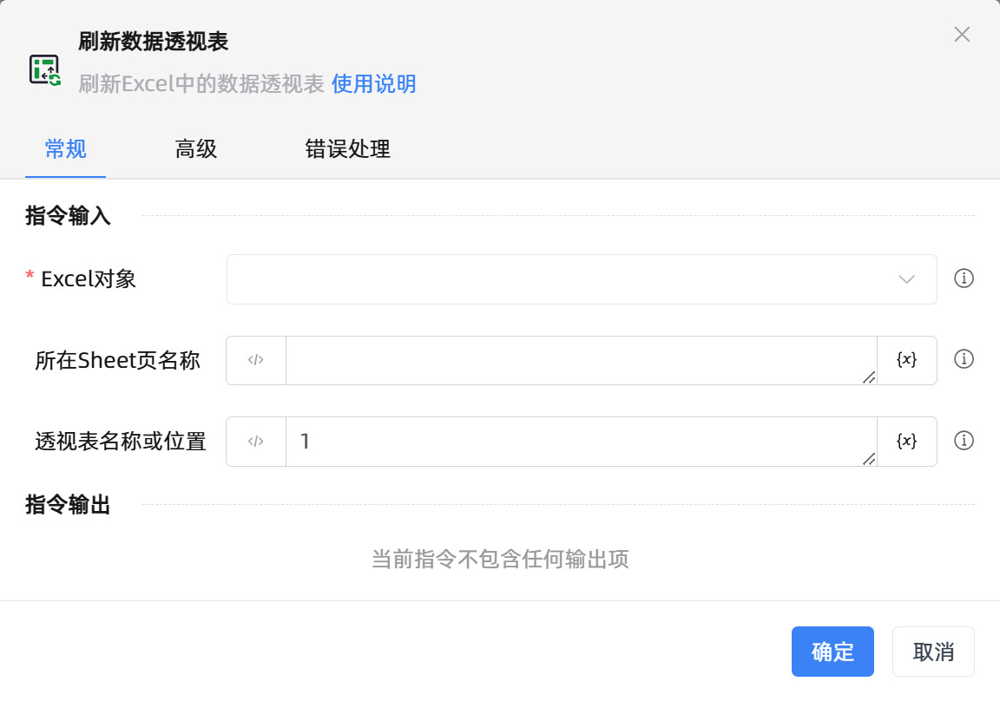

# 刷新数据透视表

## 功能说明

:::tip 功能描述
刷新Excel中的数据透视表
:::

## 配置项说明

### 常规

**指令输入**

- **Excel对象**`TWorkbookApplication`: 
  - 输入一个通过函数'打开或新建Excel'/'获取当前激活的Excel对象'存储的Excel对象

- **所在Sheet页名称**`string`: 
  - 数据透视表所在的工作表名称

- **透视表名称或位置**`string`: 
  - 如果工作表中只有一个数据透视表，填`1`即可;如果有多张，则填入相应的数据透视表名称

## 使用示例
无

