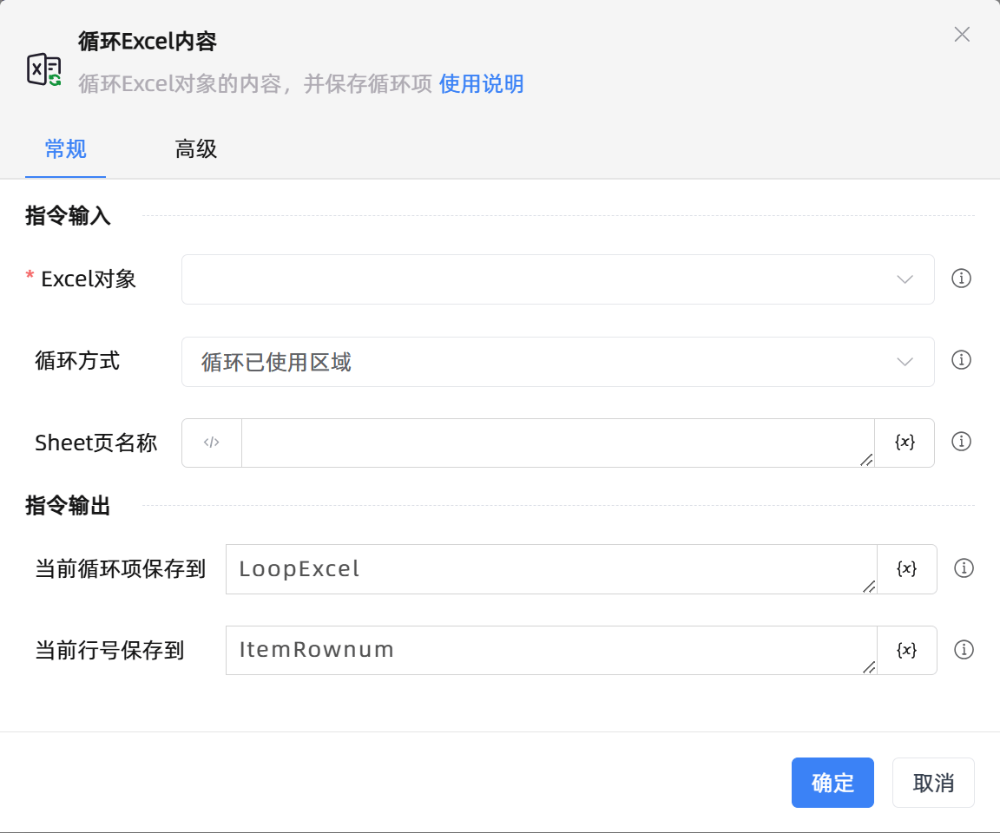

# 循环Excel内容
- 适用系统: windows / 信创

## 功能说明

:::tip 功能描述
循环Excel对象的内容，并保存循环项
:::

## 指令输入

- **Excel对象**`TWorkbookApplication`: 
    - 输入一个通过函数'打开或新建Excel'/'获取当前激活的Excel对象'存储的Excel对象

     

- **循环方式**`Integer`: 
    - 循环行：依次遍历每行内容，一行内容为一维列表格式

    - 循环列：依次遍历每列内容，一列内容为一维列表格式

    - 循环区域：依次遍历指定区域内每行内容，一行内容为一维列表格式

    - 循环已使用区域：依次遍历已使用区域内每行内容，一行内容为一维列表格式
    
     

- **开始行号**`Integer`: 
    - 开始行号,从1开始，-n表示倒数第n行

     

- **开始列名**`string`: 
    - 开始列名(支持A或1)，-n表示倒数第n列

     

- **末尾行号**`Integer`: 
    - 末尾行号,从1开始，-n表示倒数第n行

     

- **末尾列名**`string`: 
    - 末尾列名(支持A或1)，-n表示倒数第n列

     

- **起始行号**`Integer`: 
    - 起始行号,从1开始，-n表示倒数第n行

     

- **结束行号**`Integer`: 
    - 结束行号,从1开始，-n表示倒数第n行

     

- **起始列名**`string`: 
    - 起始列名(支持A或1)，-n表示倒数第n列

     

- **结束列名**`string`: 
    - 结束列名(支持A或1)，-n表示倒数第n列

     

- **Sheet页名称**`string`: 
    - 为空则默认为当前激活的Sheet页

## 指令输出

- **当前循环项保存到**`TList<String>`: 
    - 指定一个变量，用于存储Excel循环项

     

- **当前行号保存到**`Integer`: 
    - 指定一个变量，用于存储Excel循环项的行号

     

- **当前列名保存到**`string`: 
    - 指定一个变量，用于存储Excel循环项的列名

     

## 高级

- **清除单元格前后空格**`Boolean`: 
    - 自动清除内容前后空格
    
     

- **执行前的延迟(毫秒)**`Integer`: 
    - 指令执行前的等待时间

     

## 使用示例

**此流程执行逻辑：** 使用【打开/新建Excel】打开指定表格 --> 使用【循环Excel内容】指令循环自定义的区域内容 --> 循环体执行【打印日志】指令打印当前循环项 --> 直至结束行则循环结束

