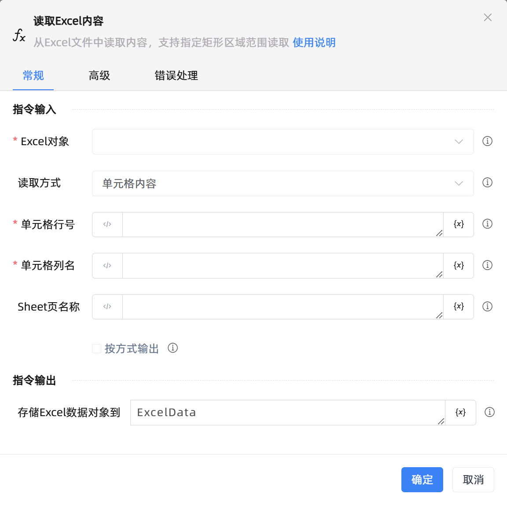

# 读取Excel内容
- 适用系统: windows / 信创

## 功能说明

:::tip 功能描述
从Excel文件中读取内容，支持指定矩形区域范围读取
:::

## 指令输入

- **Excel对象**`TWorkbookApplication`: 
    - 输入一个通过函数'打开或新建Excel'/'获取当前激活的Excel对象'存储的Excel对象

     

- **读取方式**`Integer`: 
    - 单元格/行内容/列内容/区域内容/已使用区域内容

     

- **行号**`Integer`: 
    - 指定行号,从1开始，-n表示倒数第n行

     

- **列名**`string`: 
    - 指定列名(支持A或1)，-n表示倒数第n列

     

- **Sheet页名称**`string`: 
    - 为空则默认为当前激活的Sheet页

     

- **按方式输出**`Boolean`: 
    - 勾选后,读取方式为单元格时输出字符串,行或列时输出列表,区域时输出数据表格

     

- **在数据表中预览**`Boolean`: 
    - 在数据表中预览
    
     

- **将首行设置为列头**`Boolean`: 
    - 将Excel中的第一行数据 作为数据表格的列头 不能重复

## 指令输出

- **存储Excel数据对象到**`TDataTable`: 
    - 保存读取到内容为变量

## 高级

- **清除单元格前后空格**`Boolean`: 
    - 自动清除内容前后空格

- **添加列头**`Boolean`: 
    - 勾选后将读取的第一行设置为列头,列头不能重复

- **执行前的延迟(毫秒)**`Integer`: 
    - 指令执行前的等待时间

## 使用示例

**此流程执行逻辑：** 执行【打开/新建Excel】指令打开已有的Excel表格并保存表格对象 --> 使用【读取Excel内容】指令在表格中分别读取指定单元格、指定单元格显示内容、指定行、指定列、指定区域、已使用区域内容并保存结果 --> 执行【打印日志】分别打印保存结果 --> 执行【关闭Excel】指令关闭并保存

