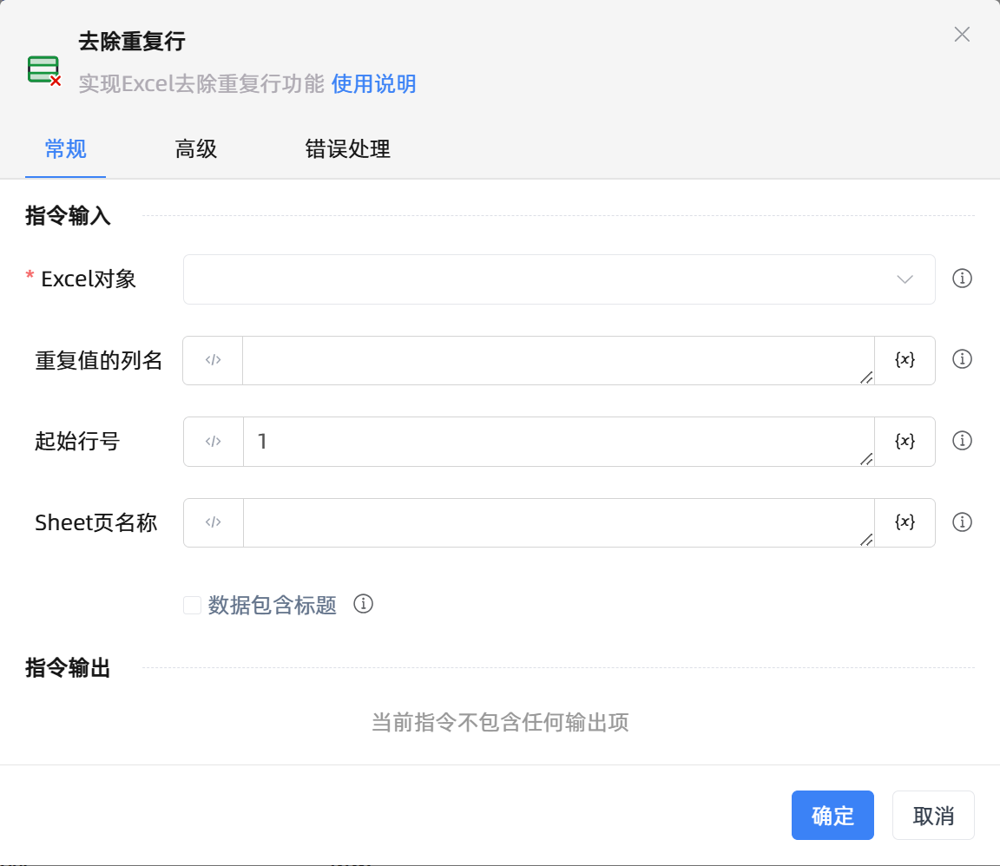

# 去除重复行
- 适用系统: windows / 信创

## 功能说明

:::tip 功能描述
实现Excel去除重复行功能
:::

## 配置项说明

### 指令输入

- **Excel对象**`string`: 
  - 输入一个通过函数'打开或新建Excel'/'获取当前激活的Excel对象'存储的Excel对象

- **重复值的列名**`string`: 
  - 指定列名(支持A或1), 多列用A,B,C或A:C, 若不填, 表示所有列

- **起始行号**`Integer`: 
  - 选填, 默认第一行开始, -n表示倒数第n行

- **Sheet页名称**`string`: 
  - 为空则默认为当前激活的Sheet页

- **数据包含标题**`Boolean`: 
  - 勾选时，第一行是标题不参与重复计算

- **执行前的延迟(毫秒)**`string`: 
  - 指令执行前的等待时间

### 指令输出

- 当前组件不包含任何输出项

### 使用示例

- [点击下载查看示例]() 
