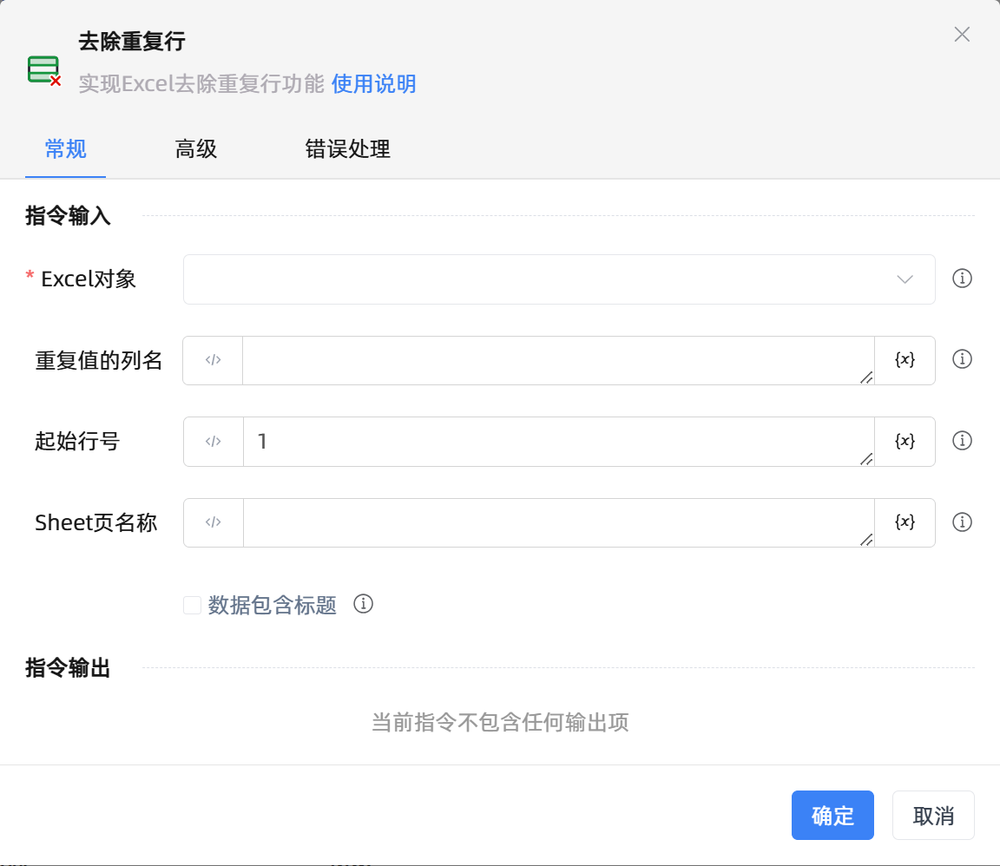

# 去除重复行

## 功能说明

:::tip 功能描述
实现Excel去除重复行功能
:::

## 配置项说明

### 常规

**指令输入**

- **Excel对象**`TWorkbookApplication`: 输入一个通过函数'打开或新建Excel'/'获取当前激活的Excel对象'存储的Excel对象

- **重复值的列名**`string`: 指定列名(支持A或1), 多列用A,B,C或A:C, 若不填, 表示所有列

- **起始行号**`Integer`: 选填, 默认第一行开始, -n表示倒数第n行

- **Sheet页名称**`string`: 为空则默认为当前激活的Sheet页

- **数据包含标题**`Boolean`: 勾选时，第一行是标题不参与重复计算

**指令输出**

当前指令无输出

### 高级

- **执行前的延迟(毫秒)**`Integer`: 指令执行前的等待时间

### 错误处理

- **打印错误日志**`Boolean`：当指令运行出错时，打印错误日志到【日志】面板。默认勾选。

- **处理方式**`Integer`：

 - **终止流程**：指令运行出错时，终止流程。

 - **忽略异常并继续执行**：指令运行出错时，忽略异常，继续执行流程。

 - **重试此指令**：指令运行出错时，重试运行指定次数指令，每次重试间隔指定时长。

## 使用示例

**流程逻辑描述：** 

## 常见错误及处理

无

## 常见问题解答

无

