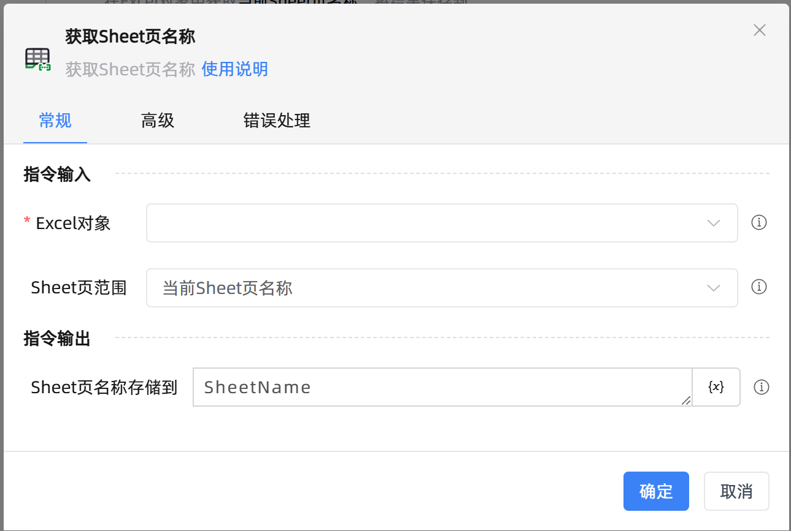

# 获取Sheet页名称
- 适用系统: windows / 信创

## 功能说明

:::tip 功能描述
获取Sheet页名称
:::

## 配置项说明

### 常规

**指令输入**

- **Excel对象**`TWorkbookApplication`: 输入一个通过函数'打开或新建Excel'/'获取当前激活的Excel对象'存储的Excel对象

- **Sheet页范围**`Integer`: 选择待获取Sheet页名称的范围。包括

    - 当前Sheet页名称：当前激活的Sheet页名称

    - 所有Sheet页名称：工作簿内所有的Sheet页名称

**指令输出**

- **Sheet页名称存储到**`string`: 存储的sheet页名

- **Sheet页名称列表存储到**`TList<String>`: 指定一个变量，用于存储Sheet页名列表

### 高级

- **执行前的延迟(毫秒)**`Integer`: 指令执行前的等待时间

### 错误处理

- **打印错误日志**`Boolean`：当指令运行出错时，打印错误日志到【日志】面板。默认勾选。

- **处理方式**`Integer`：

    - **终止流程**：指令运行出错时，终止流程。

    - **忽略异常并继续执行**：指令运行出错时，忽略异常，继续执行流程。

    - **重试此指令**：指令运行出错时，重试运行指定次数指令，每次重试间隔指定时长。

## 使用示例
无

## 常见错误及处理

无

## 常见问题解答

无

