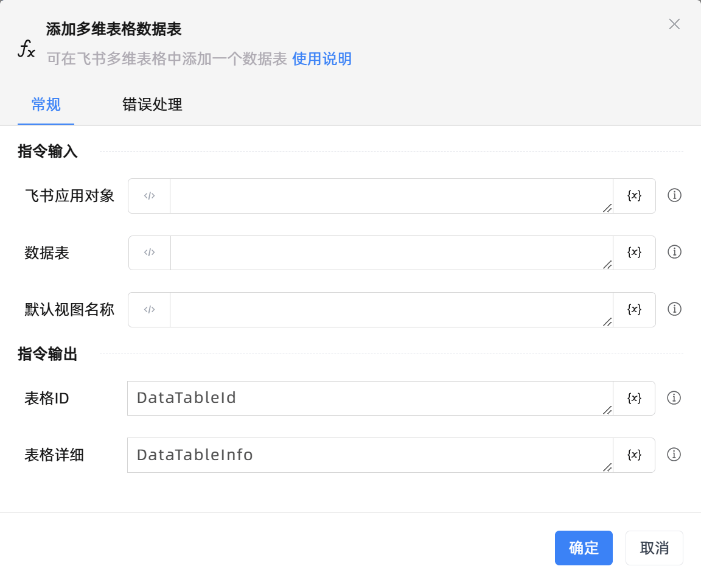

# 添加多维表格数据表

## 功能说明

:::tip 功能描述
可在飞书多维表格中添加一个数据表
:::

## 配置项说明

### 常规

**指令输入**

- **飞书应用对象**`TFeiShu`: 请输入建立飞书多维表格连接创建的飞书应用对象

- **数据表**`string`: 请输入要添加到多维表格的数据表名

- **默认视图名称**`string`: 请输入默认视图的名称，不填默认为表格名称

**指令输出**

- **表格ID**`string`: 返回添加后的表格id

- **表格详细**`string`: 返回添加后的数据表详情信息

### 错误处理

- **打印错误日志**`Boolean`：当指令运行出错时，打印错误日志到【日志】面板。默认勾选。

- **处理方式**`Integer`：

 - **终止流程**：指令运行出错时，终止流程。

 - **忽略异常并继续执行**：指令运行出错时，忽略异常，继续执行流程。

 - **重试此指令**：指令运行出错时，重试运行指定次数指令，每次重试间隔指定时长。

## 使用示例
无

## 常见错误及处理

无

## 常见问题解答

无

