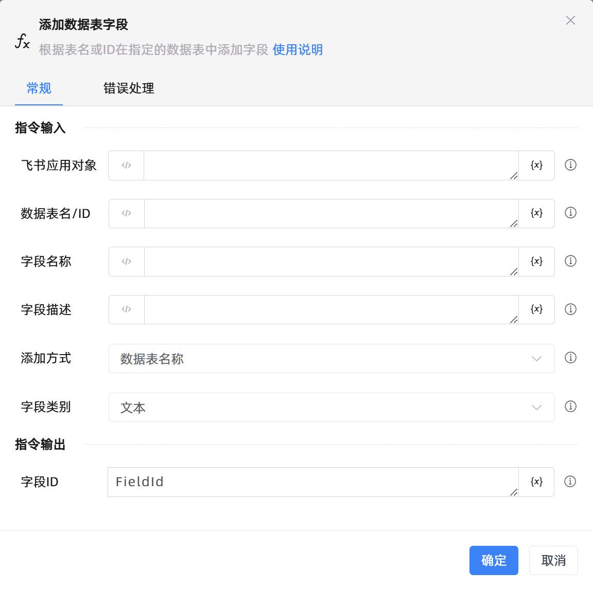

# 添加数据表字段

## 功能说明

:::tip 功能描述
根据表名或ID在指定的数据表中添加字段
:::

## 配置项说明

### 常规

**指令输入**

- **飞书应用对象**`TFeiShu`: 请输入建立飞书多维表格连接创建的飞书应用对象

- **数据表名/ID**`string`: 根据添加方式，请输入数据表名或数据表id

- **字段名称**`string`: 请输入要添加的字段的名称

- **字段描述**`string`: 请输入要添加字段的描述信息

- **添加方式**`Integer`: 请选择添加方式，可选值有数据表名、数据表id

- **字段类别**`Integer`: 请选择字段的类别，具体类型可参考官网

**指令输出**

- **字段ID**`string`: 返回添加的字段的唯一标识

### 错误处理

- **打印错误日志**`Boolean`：当指令运行出错时，打印错误日志到【日志】面板。默认勾选。

- **处理方式**`Integer`：

 - **终止流程**：指令运行出错时，终止流程。

 - **忽略异常并继续执行**：指令运行出错时，忽略异常，继续执行流程。

 - **重试此指令**：指令运行出错时，重试运行指定次数指令，每次重试间隔指定时长。

## 使用示例

**流程逻辑描述：** 

## 常见错误及处理

无

## 常见问题解答

无

