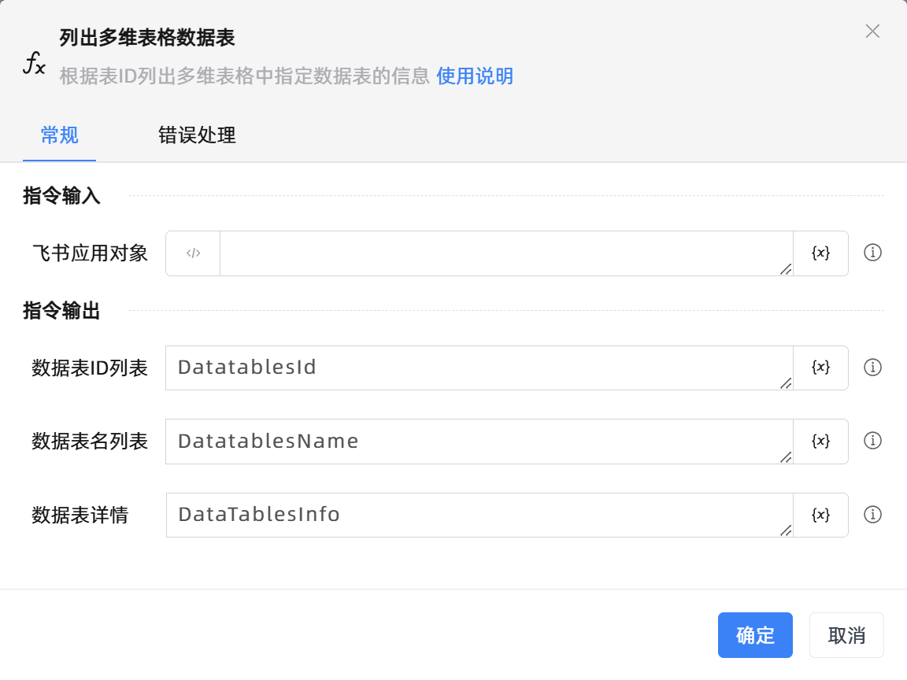

# 列出多维表格数据表

## 功能说明

:::tip 功能描述
根据表ID列出多维表格中指定数据表的信息
:::

## 配置项说明

### 常规

**指令输入**

- **飞书应用对象**`TFeiShu`: 请输入建立飞书多维表格连接创建的飞书应用对象

**指令输出**

- **数据表ID列表**`TList<string>`: 返回存放数据表id的列表

- **数据表名列表**`TList<string>`: 返回存放数据表名称的列表

- **数据表详情**`string`: 返回存放数据表的详情信息

### 错误处理

- **打印错误日志**`Boolean`：当指令运行出错时，打印错误日志到【日志】面板。默认勾选。

- **处理方式**`Integer`：

 - **终止流程**：指令运行出错时，终止流程。

 - **忽略异常并继续执行**：指令运行出错时，忽略异常，继续执行流程。

 - **重试此指令**：指令运行出错时，重试运行指定次数指令，每次重试间隔指定时长。

## 使用示例
无

## 常见错误及处理

无

## 常见问题解答

无

