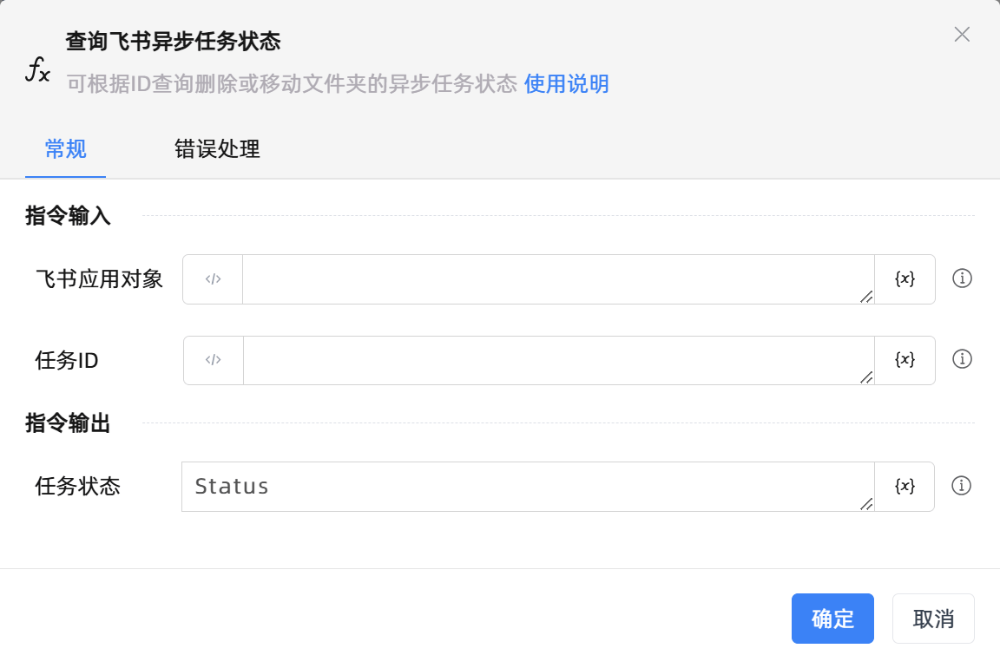

# 查询飞书异步任务状态
- 适用系统: windows

## 功能说明

:::tip 功能描述
可根据ID查询删除或移动文件夹的异步任务状态
:::

## 配置项说明

### 常规

**指令输入**

- **飞书应用对象**`TFeiShu`: 请输入飞书应用范围创建的飞书应用对象

- **任务ID**`String`: 请输入移动或删除文件夹的异步任务ID

**指令输出**

- **任务状态**`String`: 返回指定异步任务的状态

### 错误处理

- **打印错误日志**`Boolean`：当指令运行出错时，打印错误日志到【日志】面板。默认勾选。

- **处理方式**`Integer`：

 - **终止流程**：指令运行出错时，终止流程。

 - **忽略异常并继续执行**：指令运行出错时，忽略异常，继续执行流程。

 - **重试此指令**：指令运行出错时，重试运行指定次数指令，每次重试间隔指定时长。

## 使用示例
无

## 常见错误及处理

无

## 常见问题解答

无

