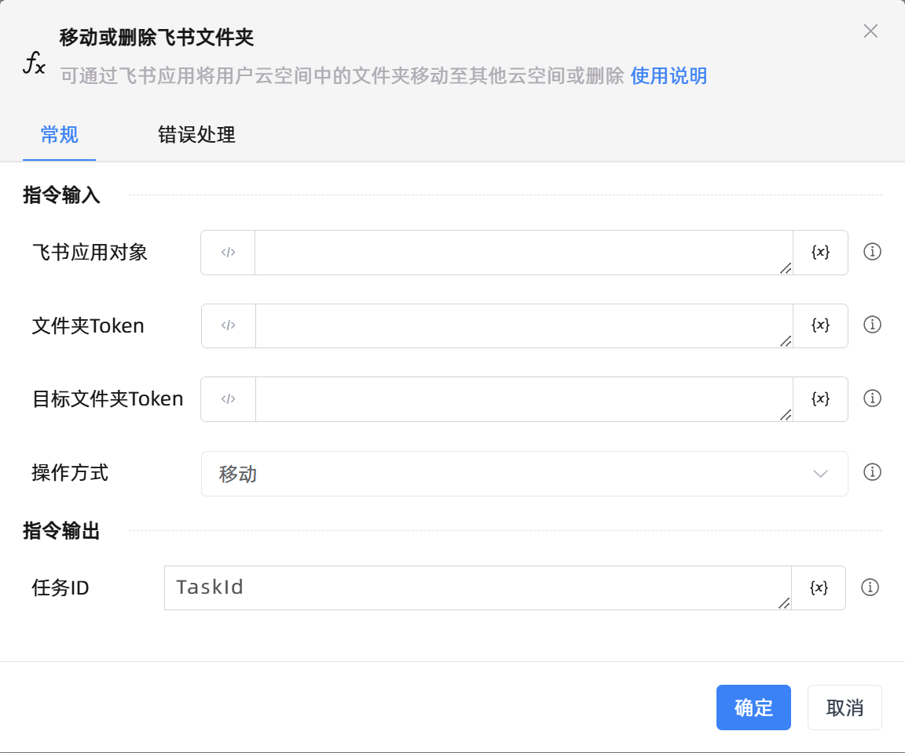

# 移动或删除飞书文件夹
- 适用系统: windows

## 功能说明

:::tip 功能描述
可通过飞书应用将用户云空间中的文件夹移动至其他云空间或删除
:::

## 配置项说明

### 常规

**指令输入**

- **飞书应用对象**`TFeiShu`: 请输入飞书应用范围创建的飞书应用对象

- **文件夹Token**`String`: 请输入飞书文件夹的token，可参考官方文档进行获取

- **目标文件夹Token**`String`: 请输入目标飞书文件夹的token，如果方式为删除，该字段将不起作用

- **操作方式**`Integer`: 请选择对文件夹的操作方式，可以选择移动或删除

**指令输出**

- **任务ID**`String`: 返回该文件夹操作的异步任务ID

### 错误处理

- **打印错误日志**`Boolean`：当指令运行出错时，打印错误日志到【日志】面板。默认勾选。

- **处理方式**`Integer`：

 - **终止流程**：指令运行出错时，终止流程。

 - **忽略异常并继续执行**：指令运行出错时，忽略异常，继续执行流程。

 - **重试此指令**：指令运行出错时，重试运行指定次数指令，每次重试间隔指定时长。

## 使用示例
无

## 常见错误及处理

无

## 常见问题解答

无

