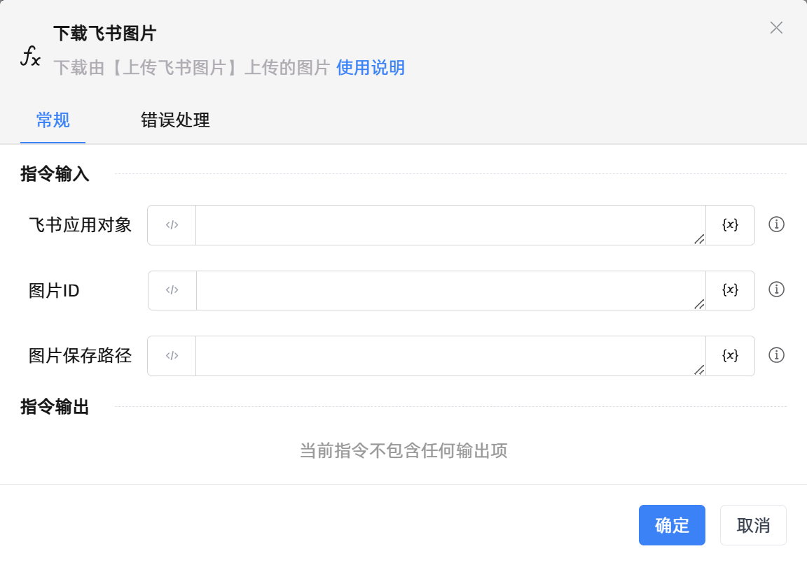

# 下载飞书图片

## 功能说明

:::tip 功能描述
下载由【上传飞书图片】上传的图片
:::

## 配置项说明

### 常规

**指令输入**

- **飞书应用对象**`TFeiShu`: 请输入飞书应用范围创建的飞书应用对象

- **图片ID**`String`: 请输入上传图片之后返回的image_key

- **图片保存路径**`String`: 请输入图片下载后的保存路径

**指令输出**

当前指令无输出

### 错误处理

- **打印错误日志**`Boolean`：当指令运行出错时，打印错误日志到【日志】面板。默认勾选。

- **处理方式**`Integer`：

 - **终止流程**：指令运行出错时，终止流程。

 - **忽略异常并继续执行**：指令运行出错时，忽略异常，继续执行流程。

 - **重试此指令**：指令运行出错时，重试运行指定次数指令，每次重试间隔指定时长。

## 使用示例

**流程逻辑描述：** 

## 常见错误及处理

无

## 常见问题解答

无

