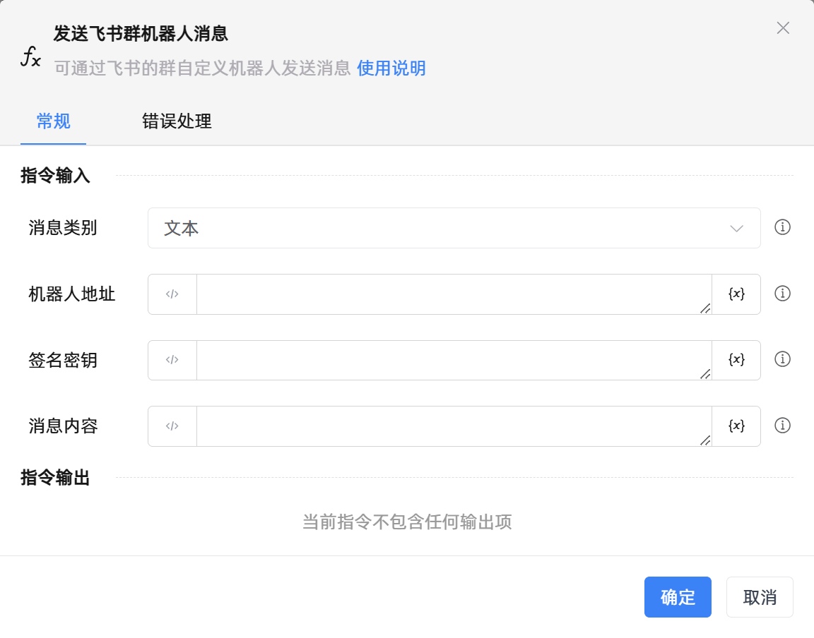

# 发送飞书群机器人消息
- 适用系统: windows

## 功能说明

:::tip 功能描述
可通过飞书的群自定义机器人发送消息
:::

## 配置项说明

### 常规

**指令输入**

- **消息类别**`Integer`: 请选择飞书机器人发送的消息类别，具体可参考官网

- **机器人地址**`String`: 请输入自定义机器人的Webhook

- **签名密钥**`String`: 请输入用来进行自定义机器人安全设置中签名验证的秘钥

- **消息内容**`String`: 请输入要发送的消息内容，具体可参考官网

**指令输出**

当前指令无输出

### 错误处理

- **打印错误日志**`Boolean`：当指令运行出错时，打印错误日志到【日志】面板。默认勾选。

- **处理方式**`Integer`：

 - **终止流程**：指令运行出错时，终止流程。

 - **忽略异常并继续执行**：指令运行出错时，忽略异常，继续执行流程。

 - **重试此指令**：指令运行出错时，重试运行指定次数指令，每次重试间隔指定时长。

## 使用示例
无

## 常见错误及处理

无

## 常见问题解答

无

