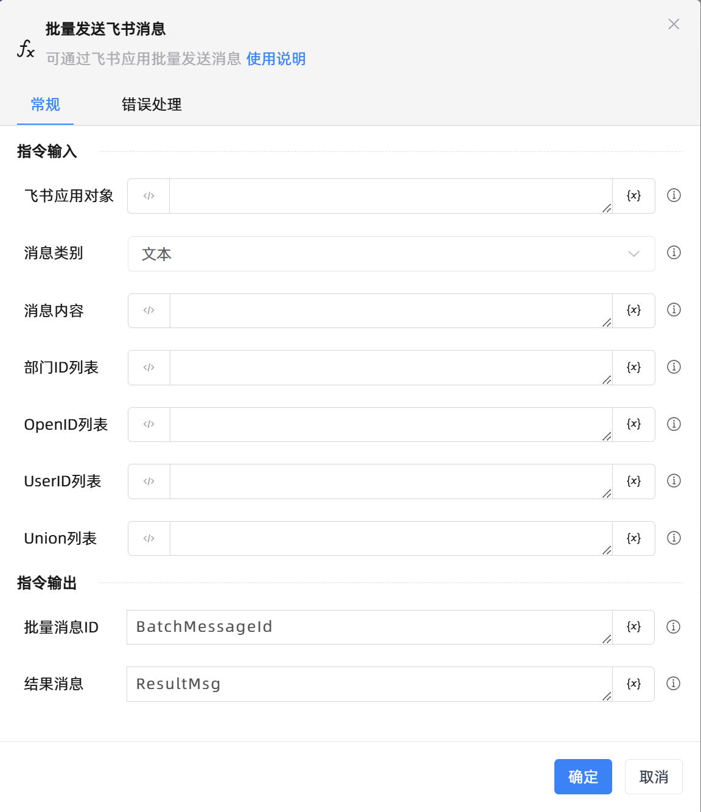

# 批量发送飞书消息

## 功能说明

:::tip 功能描述
可通过飞书应用批量发送消息
:::

## 配置项说明

### 常规

**指令输入**

- **飞书应用对象**`TFeiShu`: 请输入飞书应用范围创建的飞书应用对象

- **消息类别**`Integer`: 请选择飞书发送的消息类型，具体可参考官网

- **消息内容**`String`: 请输入要发送的消息内容

- **部门ID列表**`TList<string>`: 请输入存放部门ID的列表

- **OpenID列表**`TList<string>`: 请输入存放用户open_id的列表

- **UserID列表**`TList<string>`: 请输入存放用户user_id列表

- **Union列表**`TList<string>`: 请输入存放用户union_id列表

**指令输出**

- **批量消息ID**`String`: 返回批量发送消息成功后的消息ID

- **结果消息**`String`: 返回批量发送消息成功后的结果

### 错误处理

- **打印错误日志**`Boolean`：当指令运行出错时，打印错误日志到【日志】面板。默认勾选。

- **处理方式**`Integer`：

 - **终止流程**：指令运行出错时，终止流程。

 - **忽略异常并继续执行**：指令运行出错时，忽略异常，继续执行流程。

 - **重试此指令**：指令运行出错时，重试运行指定次数指令，每次重试间隔指定时长。

## 使用示例
无

## 常见错误及处理

无

## 常见问题解答

无

