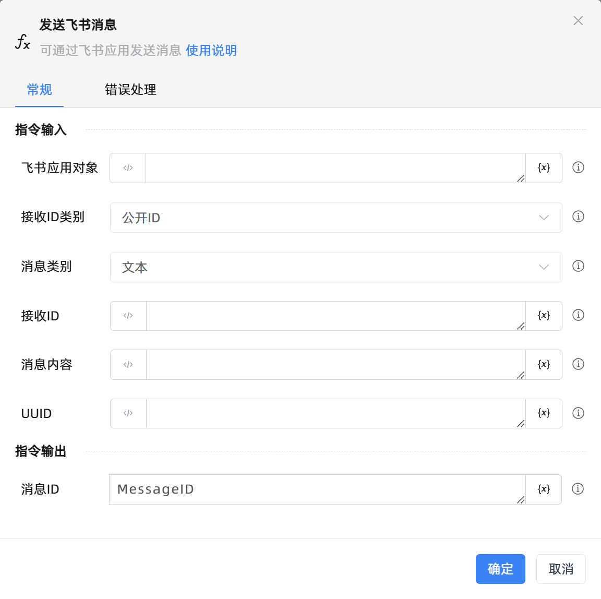

# 发送飞书消息

## 功能说明

:::tip 功能描述
可通过飞书应用发送消息
:::

## 配置项说明

### 常规

**指令输入**

- **飞书应用对象**`TFeiShu`: 请输入飞书应用范围创建的飞书应用对象

- **接收ID类别**`Integer`: 飞书应用接受消息的ID类型，可以选择open_id、union_id、user_id、email、chat_id

- **消息类别**`Integer`: 飞书应用接收的消息类型，可以选择文本、富文本、图片、文件、语音、视频、表情包、卡片、分享群名片、分享个人名片、系统消息

- **接收ID**`String`: 请输入飞书应用接受信息的ID，需搭配接收ID类型使用

- **消息内容**`String`: 请输入发送的消息内容，通常为json字符串

- **UUID**`String`: 请输入自定义设置的唯一字符串序列，可用于在发送消息时请求去重

**指令输出**

- **消息ID**`String`: 返回发送消息成功之后的消息ID

### 错误处理

- **打印错误日志**`Boolean`：当指令运行出错时，打印错误日志到【日志】面板。默认勾选。

- **处理方式**`Integer`：

 - **终止流程**：指令运行出错时，终止流程。

 - **忽略异常并继续执行**：指令运行出错时，忽略异常，继续执行流程。

 - **重试此指令**：指令运行出错时，重试运行指定次数指令，每次重试间隔指定时长。

## 使用示例
无

## 常见错误及处理

无

## 常见问题解答

无

