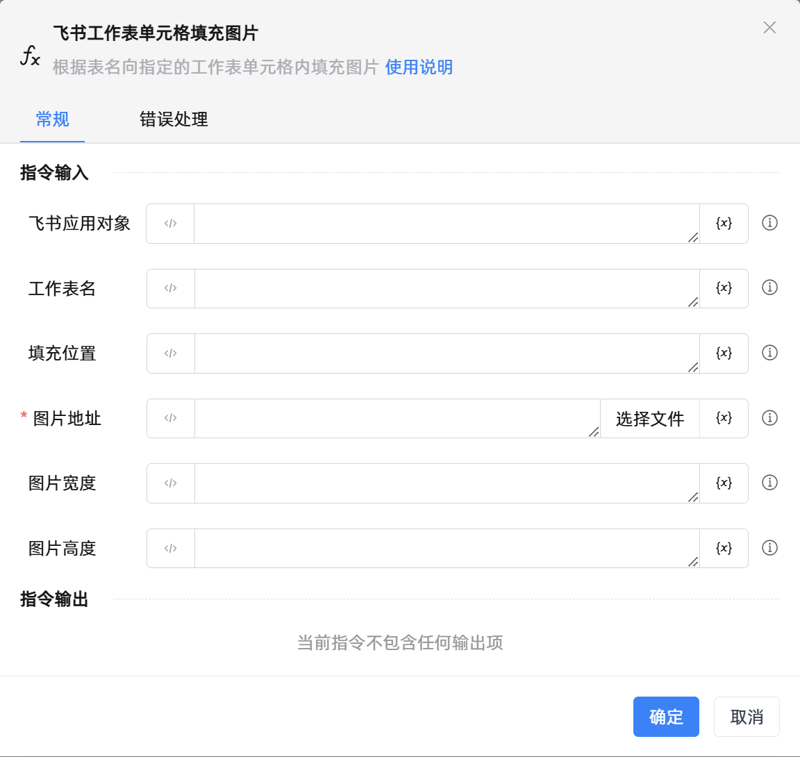

# 飞书工作表单元格填充图片

## 功能说明

:::tip 功能描述
根据表名向指定的工作表单元格内填充图片
:::

## 配置项说明

### 常规

**指令输入**

- **飞书应用对象**`TFeiShu`: 请输入建立飞书电子表格连接创建的飞书应用对象

- **工作表名**`string`: 请输入要在单元格填充图片的工作表名称

- **填充位置**`string`: 请输入要填充图片的单元格的位置，如A1、B4

- **图片地址**`string`: 请输入或选择要填充单元格的图片地址

- **图片宽度**`Integer`: 请输入要写入单元格的图片宽度

- **图片高度**`Integer`: 请输入要写入单元格的图片高度

**指令输出**

当前指令无输出

### 错误处理

- **打印错误日志**`Boolean`：当指令运行出错时，打印错误日志到【日志】面板。默认勾选。

- **处理方式**`Integer`：

 - **终止流程**：指令运行出错时，终止流程。

 - **忽略异常并继续执行**：指令运行出错时，忽略异常，继续执行流程。

 - **重试此指令**：指令运行出错时，重试运行指定次数指令，每次重试间隔指定时长。

## 使用示例

**流程逻辑描述：** 

## 常见错误及处理

无

## 常见问题解答

无

