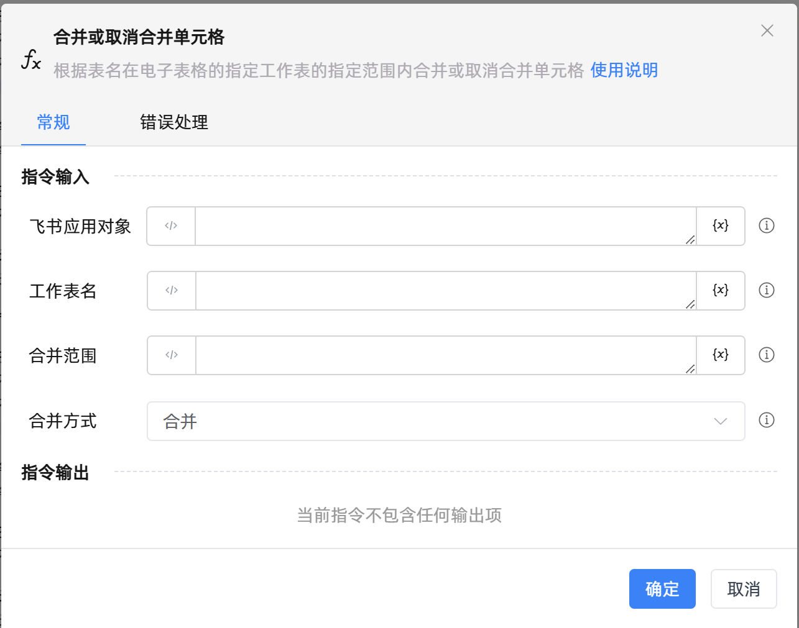

# 合并/取消合并单元格

## 功能说明

:::tip 功能描述
根据表名在电子表格的指定工作表的指定范围内合并或取消合并单元格
:::

## 配置项说明

### 常规

**指令输入**

- **飞书应用对象**`TFeiShu`: 请输入建立飞书电子表格连接创建的飞书应用对象

- **工作表名**`string`: 请输入要合并单元格的Sheet页名称

- **合并范围**`string`: 请输入要合并单元格的范围

- **合并方式**`Integer`: 请选择合并的方式，可以选择的值合并、取消合并

**指令输出**

当前指令无输出

### 错误处理

- **打印错误日志**`Boolean`：当指令运行出错时，打印错误日志到【日志】面板。默认勾选。

- **处理方式**`Integer`：

 - **终止流程**：指令运行出错时，终止流程。

 - **忽略异常并继续执行**：指令运行出错时，忽略异常，继续执行流程。

 - **重试此指令**：指令运行出错时，重试运行指定次数指令，每次重试间隔指定时长。

## 使用示例

**流程逻辑描述：** 

## 常见错误及处理

无

## 常见问题解答

无

