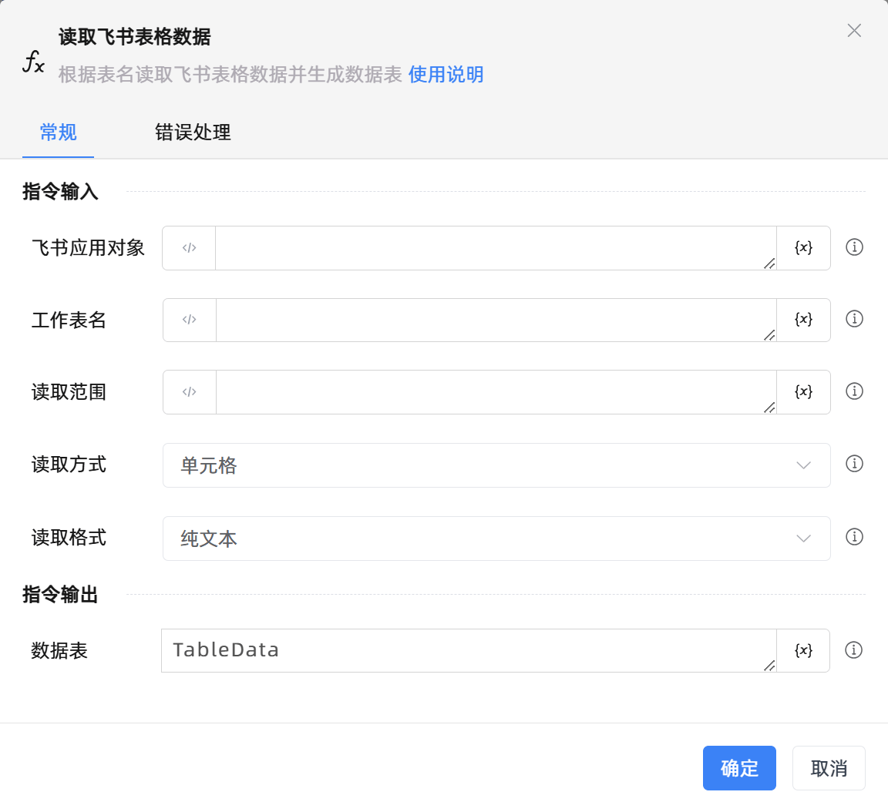

# 读取飞书表格数据

## 功能说明

:::tip 功能描述
根据表名读取飞书表格数据并生成数据表
:::

## 配置项说明

### 常规

**指令输入**

- **飞书应用对象**`TFeiShu`: 请输入建立飞书电子表格连接创建的飞书应用对象

- **工作表名**`string`: 请输入要读取数据的工作表名称

- **读取范围**`string`: 请输入要读取数据的工作表范围,如行对应1，列对应B，区域对应A1:B2,为空时输出当前表格所有数据

- **读取方式**`Integer`: 请选择读取数据的工作表的方式

- **读取格式**`Integer`: 请选择读取数据的工作表的格式

- **在数据表中预览**`Boolean`: 在数据表中预览

**指令输出**

- **数据表**`TDataTable`: 返回读取表数据之后生成的数据表

### 错误处理

- **打印错误日志**`Boolean`：当指令运行出错时，打印错误日志到【日志】面板。默认勾选。

- **处理方式**`Integer`：

 - **终止流程**：指令运行出错时，终止流程。

 - **忽略异常并继续执行**：指令运行出错时，忽略异常，继续执行流程。

 - **重试此指令**：指令运行出错时，重试运行指定次数指令，每次重试间隔指定时长。

## 使用示例

**流程逻辑描述：** 

## 常见错误及处理

无

## 常见问题解答

无

