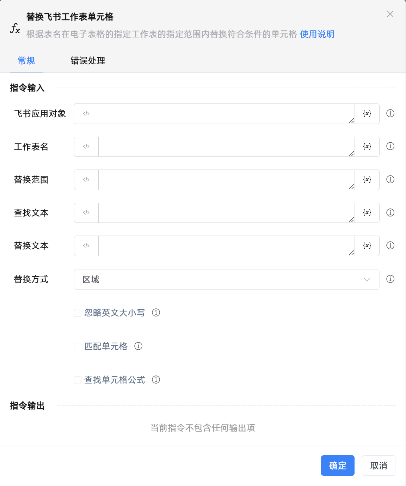

# 替换飞书工作表单元格

## 功能说明

:::tip 功能描述
根据表名在电子表格的指定工作表的指定范围内替换符合条件的单元格
:::

## 配置项说明

### 常规

**指令输入**

- **飞书应用对象**`TFeiShu`: 请输入建立飞书电子表格连接创建的飞书应用对象

- **工作表名**`string`: 请输入要替换单元格的Sheet页名称

- **替换范围**`string`: 请输入要替换单元格的范围

- **查找文本**`string`: 请输入要查找的文本内容

- **替换文本**`string`: 请输入要替换为的文本内容

- **替换方式**`Integer`: 请选择替换方式，可选值有区域、行、列

- **忽略英文大小写**`Boolean`: 勾选后将忽略英文大小写

- **匹配单元格**`Boolean`: 勾选后将匹配整个单元格的内容

- **查找单元格公式**`Boolean`: 勾选后将仅查找单元格公式

**指令输出**

当前指令无输出

### 错误处理

- **打印错误日志**`Boolean`：当指令运行出错时，打印错误日志到【日志】面板。默认勾选。

- **处理方式**`Integer`：

 - **终止流程**：指令运行出错时，终止流程。

 - **忽略异常并继续执行**：指令运行出错时，忽略异常，继续执行流程。

 - **重试此指令**：指令运行出错时，重试运行指定次数指令，每次重试间隔指定时长。

## 使用示例

**流程逻辑描述：** 

## 常见错误及处理

无

## 常见问题解答

无

